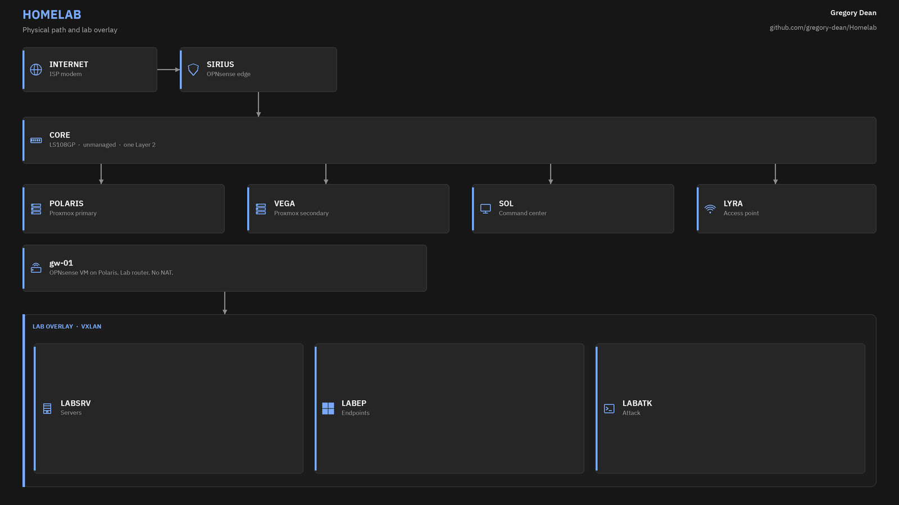
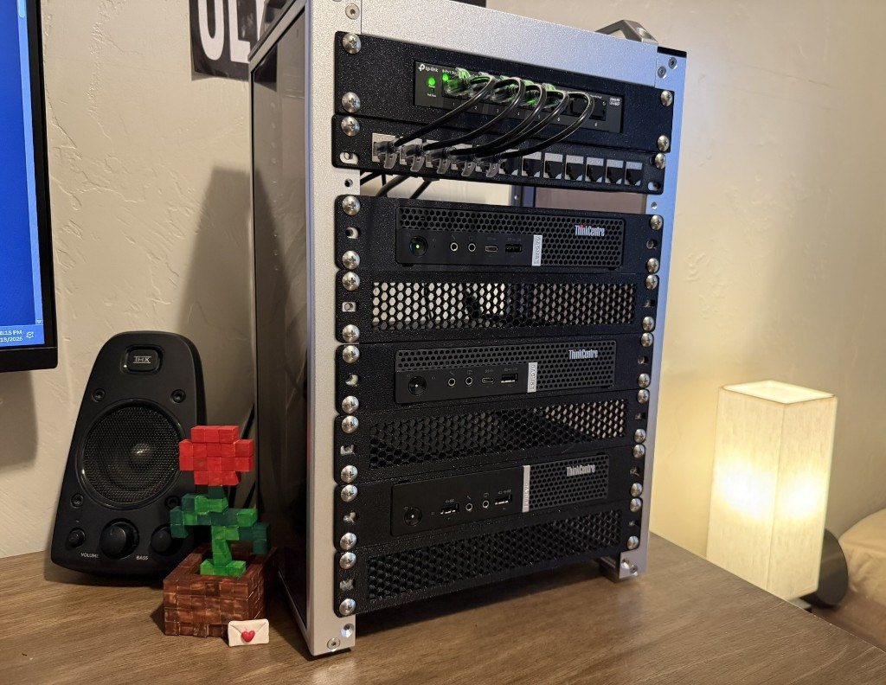

# Homelab

I run a 10 inch rack on the desk. OPNsense sits at the edge. Two Proxmox nodes hold the guests. This Windows desktop is the command center.

I use it for security work and for things I want to host myself.

The switch in this cabinet cannot do VLANs. Isolation is a VXLAN overlay between the two Proxmox nodes, plus a second OPNsense install that only routes the lab. Sirius never sees traffic between two devices on the same switch. That is why both firewalls exist.

## Hosts

| Name | Device | Role | Address |
| ---- | ------ | ---- | ------- |
| Sirius | M720q i5-8400T | OPNsense, physical edge | `10.10.10.1` |
| Polaris | M720q i5-9500T | Proxmox, primary | `10.10.10.11` |
| Vega | M715q Ryzen 3 PRO 2200GE | Proxmox, secondary | `10.10.10.12` |
| Sol | Ryzen 7 5800X desktop | Command center | `10.10.10.154` |
| Lyra | Archer AX6000 | Access point | `10.10.10.2` |
| gw-01 | VM on Polaris | OPNsense, lab router | `10.10.10.3` |
| dc-01 | VM on Polaris | AD DS | `10.30.10.10` |
| winclient-01 | VM on Polaris | Windows 11 Pro, domain joined | `10.30.20.20` |
| siem-01 | VM on Polaris | Wazuh | `10.30.10.50` |
| ubuntu-01 | VM on Vega | Ubuntu Server, off domain | `10.30.10.40` |
| kali-01 | VM on Vega | Kali, off domain | `10.30.30.30` |

Star names stay on the metal. Role names stay on the guests.

## Docs

Reference. Addresses, and hardware.

- [Architecture](docs/architecture.md)
- [Hardware](docs/hardware.md)
- [Network](docs/network.md)
- [Inventory](docs/inventory.md)

## Guides

How I built each piece.

- [Rack](guides/rack.md)
- [Firewall](guides/firewall.md)
- [Hypervisor](guides/hypervisor.md)
- [Switching](guides/switching.md)
- [Access point](guides/access-point.md)
- [Command center](guides/command-center.md)
- [Lab guests](guides/lab-guests.md)

