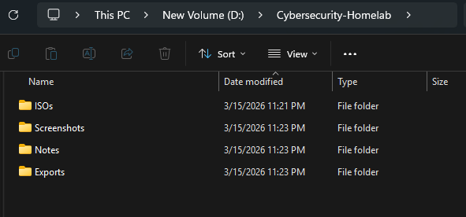
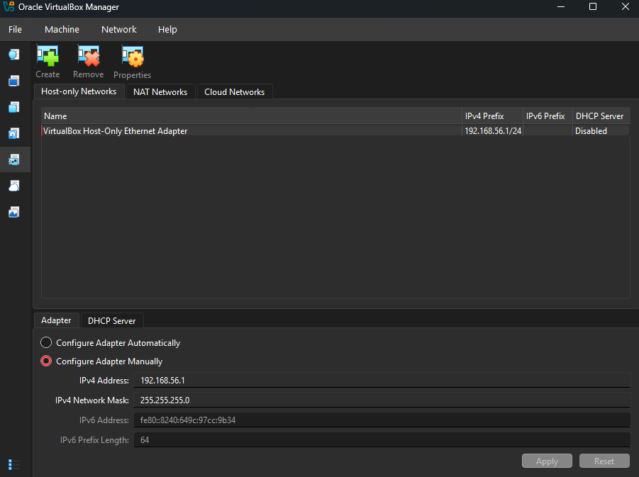
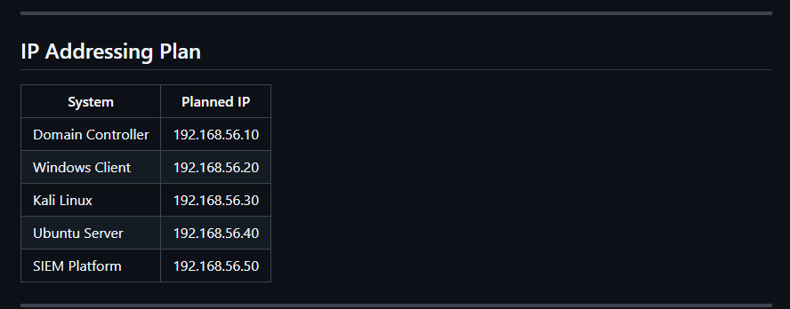

# Cybersecurity Homelab

This repository documents the design, build process, and security experiments performed in my personal cybersecurity homelab.

The goal of this project is to build a controlled enterprise-style lab for practicing system administration, networking, detection engineering, vulnerability management, and attack simulation while documenting each phase in a structured and public-facing way.

The lab is continuously evolving as I expand the infrastructure and add new security tools and testing scenarios.

---

## Lab architecture

---

## Current Status

Phase 1 - Foundation is complete.

Completed work includes:

- VirtualBox host-only and NAT network design
- Deployment of core virtual machines
- Static internal IP addressing
- Host-to-host connectivity validation
- Initial troubleshooting documentation
- Build notes and screenshot collection

The next phase will focus on Identity and Access by configuring Active Directory, creating users and groups, and joining the Windows client to the domain.

---

## Objectives

- Build a realistic enterprise-style security lab
- Practice both offensive and defensive security concepts
- Simulate attack activity in a controlled environment
- Generate and analyze logs across Windows and Linux systems
- Document the full build process for learning and portfolio development

---

## Lab Architecture

This lab is built on a Windows 11 host using Oracle VirtualBox.

### Current Core Systems

- `DC-01` - Windows Server
- `WINCLIENT-01` - Windows client workstation
- `KALI-01` - Kali Linux attack machine
- `UBUNTU-01` - Ubuntu Server
- `SIEM-01` - Planned for a future phase

### Internal Lab Network

- Subnet: `192.168.56.0/24`
- VirtualBox NAT used for outbound internet access
- VirtualBox Host-Only Adapter used for internal lab communication

### Planned IP Assignments

| System | IP Address |
|--------|-----------|
| DC-01 | 192.168.56.10 |
| WINCLIENT-01 | 192.168.56.20 |
| KALI-01 | 192.168.56.30 |
| UBUNTU-01 | 192.168.56.40 |
| SIEM-01 | 192.168.56.50 |

---

## Phase Roadmap

### Phase 1 - Foundation
- [x] Configure VirtualBox networking
- [x] Deploy Windows Server VM
- [x] Deploy Windows client VM
- [x] Deploy Kali Linux VM
- [x] Deploy Ubuntu Server VM
- [x] Validate host-to-host communication
- [x] Document IP scheme and roles

### Phase 2 - Identity and Access
- [ ] Configure Active Directory
- [ ] Create test users and groups
- [ ] Join Windows client to domain
- [ ] Validate domain logins
- [ ] Document Group Policy basics

### Phase 3 - Monitoring and Detection
- [ ] Deploy SIEM
- [ ] Forward Windows logs
- [ ] Forward Linux logs
- [ ] Validate ingestion
- [ ] Build first detections
- [ ] Map activity to MITRE ATT&CK

### Phase 4 - Vulnerability Management
- [ ] Deploy scanner
- [ ] Run discovery scans
- [ ] Run authenticated scans
- [ ] Prioritize findings
- [ ] Perform remediation
- [ ] Retest and document fixes

### Phase 5 - Attack Simulation
- [ ] Perform network reconnaissance
- [ ] Simulate brute-force activity
- [ ] Test privilege escalation paths
- [ ] Simulate lateral movement
- [ ] Investigate logs and alerts
- [ ] Write findings and lessons learned

---

## Tools and Technologies

### Platforms and Operating Systems
- Windows 11
- Windows Server
- Windows 10 / 11
- Ubuntu Server
- Kali Linux

### Infrastructure
- Oracle VirtualBox
- Host-only networking
- NAT networking
- Active Directory (planned)

### Security Tooling
- Nmap
- Wireshark
- Splunk or Elastic
- Nessus or OpenVAS
- Metasploit
- Burp Suite

---

## Documentation

Detailed project documentation is organized throughout the repository:

- `docs/roadmap.md`
- `docs/lab-architecture.md`
- `docs/asset-inventory.md`
- `docs/troubleshooting.md`
- `projects/01-ad-lab-foundation/`

---

## Phase 1 Highlights

#### Project workspace

#### ISO collection

#### Host-only network configuration

#### Lab IP addressing plan

#### Current lab state

For the full walkthrough, see:
[`projects/00-lab-foundation-and-networking/README.md`](projects/00-lab-foundation-and-networking/README.md)
