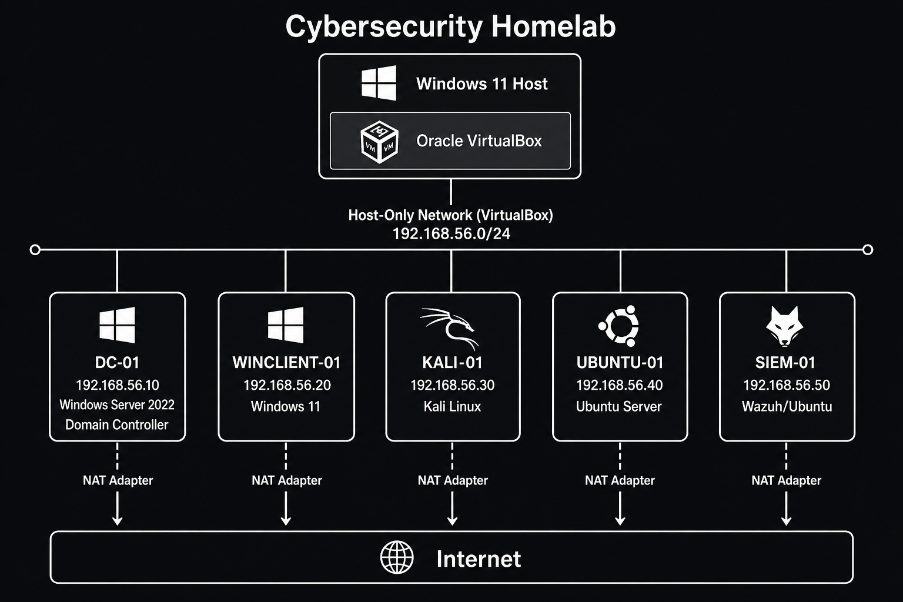

# Cybersecurity Homelab

This repository documents the design, build process, and security experiments performed in my personal cybersecurity homelab.

The goal of this project is to build a controlled enterprise-style lab for practicing system administration, networking, detection engineering, vulnerability management, and attack simulation while documenting each phase in a structured and public-facing way.

The lab is continuously evolving as I expand the infrastructure and add new security tools and testing scenarios.

---

## Current Status

Phase 1 - Foundation is complete.  
Phase 2 - Identity and Access is complete.  
Phase 3 - Monitoring and Detection is in progress.

Completed work includes:

- VirtualBox host-only and NAT network design
- Deployment of core virtual machines
- Static internal IP addressing
- Host-to-host connectivity validation
- Active Directory Domain Services installation
- Promotion of `DC-01` to a domain controller
- Creation of domain users, groups, and organizational units
- Domain join of `WINCLIENT-01`
- Domain login validation
- Basic Group Policy documentation
- Wazuh SIEM deployment on `SIEM-01`
- Wazuh agent installation on `DC-01` with Sysmon log forwarding
- Build notes and screenshot collection

Remaining Phase 3 work includes Linux log onboarding, ingestion validation, and initial detections.

---

## Objectives

- Build a realistic enterprise-style security lab
- Practice both offensive and defensive security concepts
- Simulate attack activity in a controlled environment
- Generate and analyze logs across Windows and Linux systems
- Document the full build process for learning and portfolio development

---

## Lab Architecture

This lab is built on a Windows 11 host using Oracle VirtualBox.

### Current Core Systems

- `DC-01` - Windows Server 2022 Domain Controller
- `WINCLIENT-01` - Domain-joined Windows workstation
- `KALI-01` - Kali Linux attack machine
- `UBUNTU-01` - Ubuntu Server
- `SIEM-01` - Wazuh monitoring platform

### Internal Lab Network

- Subnet: `192.168.56.0/24`
- VirtualBox NAT used for outbound internet access
- VirtualBox Host-Only Adapter used for internal lab communication

See [docs/asset-inventory.md](docs/asset-inventory.md) for the full asset table and IP addressing plan.

---

## Phase Roadmap

Phases 1–2 are complete. Phase 3 is in progress (SIEM deployed, DC-01 onboarded with Sysmon).

See [docs/roadmap.md](docs/roadmap.md) for the full checklist.

---

## Tools and Technologies

### Platforms and Operating Systems
- Windows 11
- Windows Server 2022
- Ubuntu Server
- Kali Linux

### Infrastructure
- Oracle VirtualBox
- Host-only networking
- NAT networking
- Active Directory Domain Services
- Group Policy
- DNS

### Security Tooling
- Wazuh
- Sysmon
- Nmap
- Wireshark
- Nessus or OpenVAS
- Metasploit
- Burp Suite

---

## Documentation

See [docs/README.md](docs/README.md) for the full documentation index.
