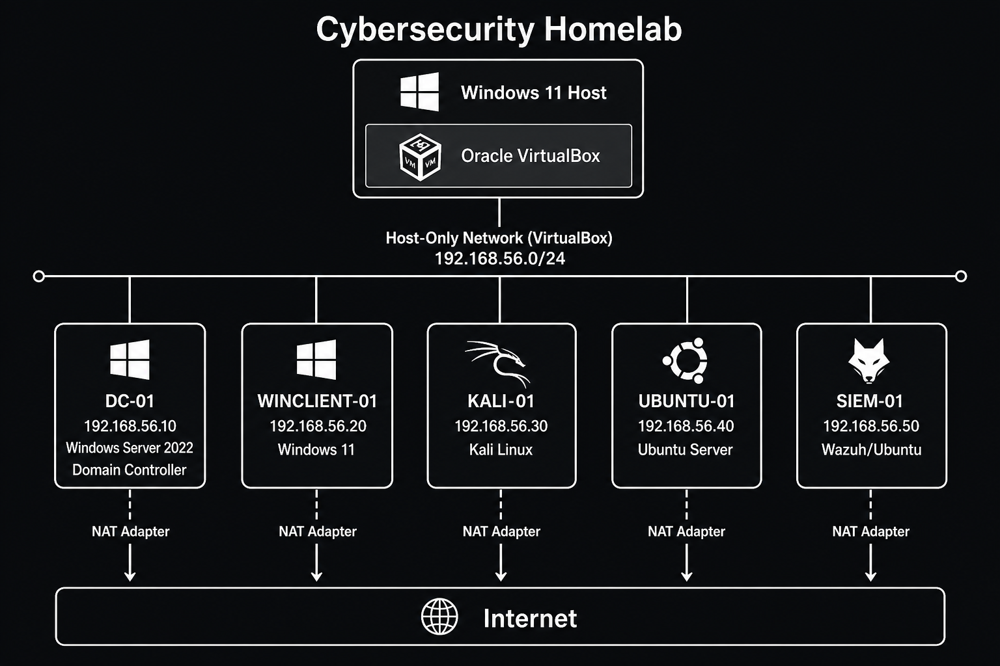

# Homelab

This repository documents my homelab in two tracks:

1. **Physical infrastructure** — as-built ops runbooks for the rack (modem → OPNsense → switch → Proxmox → services)
2. **Cybersecurity lab** — VirtualBox-based enterprise-style security practice (AD, SIEM, attack simulation)

The physical track is the source of truth for live hardware and network state. The VirtualBox projects remain as a learning / portfolio journal and may later migrate onto Proxmox (see [homelab/12-security-lab.md](homelab/12-security-lab.md)).

---

## Physical infrastructure (start here)

Work through [homelab/README.md](homelab/README.md) in numeric order. Each document has a "Done when" checklist.

| # | Document | What it covers |
|---|----------|----------------|
| 00 | [Inventory](homelab/00-inventory.md) | Devices, specs, roles, power notes |
| 01 | [Physical topology](homelab/01-physical-topology.md) | Modem → firewall → switch → devices |
| 02 | [IP addressing](homelab/02-ip-addressing.md) | Subnets, statics, DHCP, DNS names |
| 03 | [Cabling and patching](homelab/03-cabling-and-patching.md) | Switch / panel map, labeling |
| 04 | [OPNsense baseline](homelab/04-opnsense-baseline.md) | WAN/LAN, DHCP, DNS, hardening |
| 05 | [Access point](homelab/05-access-point.md) | Archer AX6000 in true AP mode |
| 06 | [Proxmox baseline](homelab/06-proxmox-baseline.md) | Static IP, updates, SSH, storage |
| 07 | [Core services](homelab/07-core-services.md) | Pi-hole, Docker LXC, NPM, Vaultwarden, … |
| 08 | [Remote access](homelab/08-remote-access.md) | Tailscale; Cloudflare Tunnel later |
| 09 | [Backups](homelab/09-backups.md) | Proxmox backups, config exports, 3-2-1 |
| 10 | [VLANs and segmentation](homelab/10-vlans-and-segmentation.md) | Managed-switch upgrade path |
| 11 | [Storage / NAS](homelab/11-storage-nas.md) | TrueNAS phase (deferred) |
| 12 | [Security lab](homelab/12-security-lab.md) | Kali, DVWA, isolation rules |
| 13 | [Hardening and operations](homelab/13-hardening-and-ops.md) | Ongoing maintenance cadence |
| — | [CHANGELOG](homelab/CHANGELOG.md) | Dated IP / port / config changes |

### Current physical status (as-built, 2026-08)

| Item | State |
|------|-------|
| Internet edge | Netgear CM2000 → OPNsense WAN (`igb1`) — working, WAN config unverified |
| Firewall | Lenovo M720q / OPNsense, LAN `192.168.10.1/24` |
| Switch | TP-Link LS108GP (unmanaged PoE+) |
| Wi-Fi | TP-Link Archer AX6000 — AP mode unverified |
| Compute | Lenovo M715q — Proxmox installed, largely unconfigured |
| Services | None deployed yet |

---

## Cybersecurity lab (VirtualBox journal)

Earlier phases run on a Windows 11 host with Oracle VirtualBox (`192.168.56.0/24` host-only).

| Phase | Project | Status |
|-------|---------|--------|
| 1 | [Lab Foundation and Networking](projects/01-lab-foundation-and-networking/) | Complete |
| 2 | [AD Identity and Access](projects/02-ad-identity-and-access/) | Complete |
| 3 | [Log Collection and SIEM Onboarding](projects/03-log-collection-and-siem-onboarding/) | In progress |
| 4 | [Vulnerability Management Workflow](projects/04-vulnerability-management-workflow/) | Planned |
| 5 | [Attack Simulation and Detection](projects/05-attack-simulation-and-detection/) | Planned |
| 6 | [Linux Hardening and Monitoring](projects/06-linux-hardening-and-monitoring/) | Planned |



See [docs/README.md](docs/README.md) for the virtual-lab documentation index, [docs/roadmap.md](docs/roadmap.md) for the phase checklist, and [docs/asset-inventory.md](docs/asset-inventory.md) for VirtualBox IPs.

---

## Repository layout

```
homelab/     → physical ops runbooks (source of truth for live gear)
docs/        → VirtualBox lab reference docs + diagram
projects/    → VirtualBox phase journals (README + notes + images)
```

## Conventions

- **Physical changes:** Log every IP, port, VLAN, or config change in [homelab/CHANGELOG.md](homelab/CHANGELOG.md) before or right after the change.
- **Screenshots:** Store under `projects/NN-<name>/images/` for VirtualBox phases.
- **Credentials:** Never commit passwords, API keys, or screenshots that show secrets.
