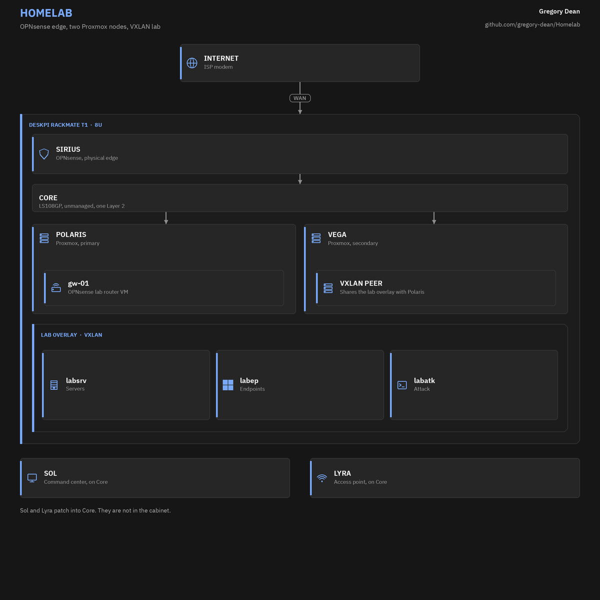
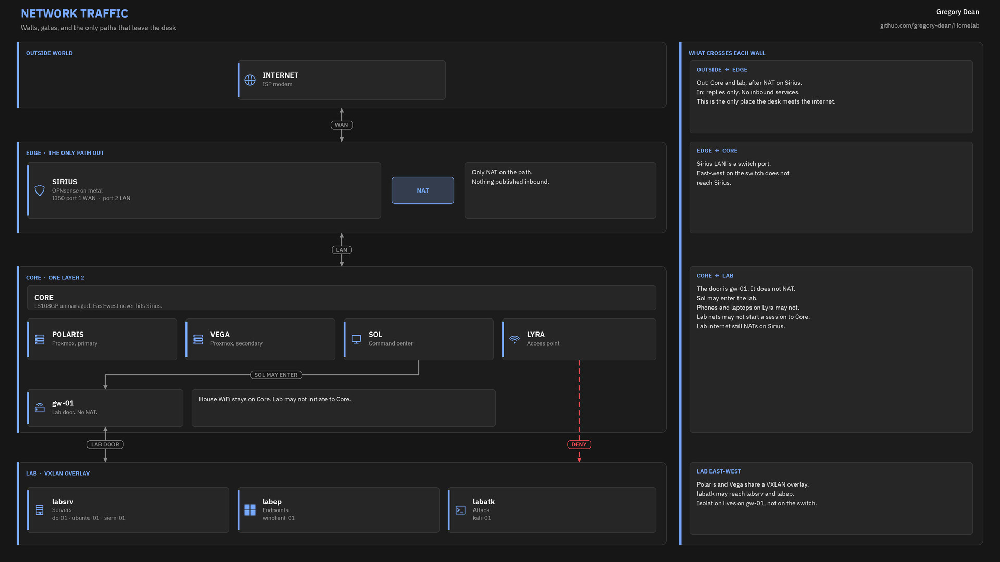
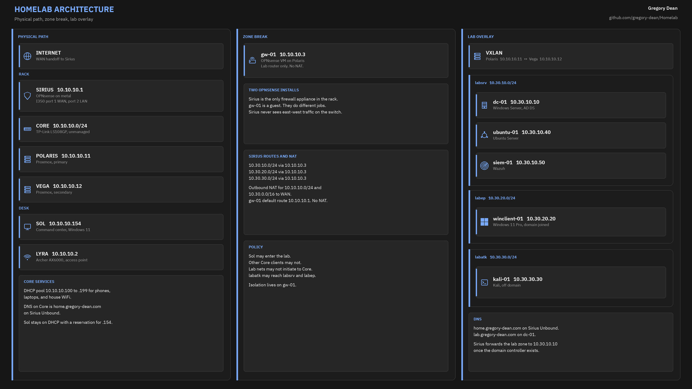

# Architecture

The lab is a 10 inch rack on the desk, an edge firewall, two Proxmox nodes, and a Windows desktop I use as the command center.

## Physical path

Internet hits an ISP modem, then Sirius.

Sirius is a Lenovo M720q (i5-8400T) running OPNsense on the metal. A 10Gtek Intel I350 four port card handles WAN and LAN:

- I350 port 1: WAN to the modem
- I350 port 2: LAN `10.10.10.1` to the switch

The switch is a TP-Link LS108GP. It is unmanaged. It cannot do VLANs. Everything patched into it shares one Layer 2 network. I call that Core.

From the switch, a 12 port keystone panel reaches:

- Polaris, Lenovo M720q i5-9500T, Proxmox
- Vega, Lenovo M715q Ryzen 3 PRO 2200GE, Proxmox
- Sol, the Windows 11 desktop
- Lyra, Archer AX6000 in access point mode

## Two OPNsense installs

They are easy to mix up. Only one is a computer in the rack.

**Sirius** is the physical edge. It owns WAN, house internet, Core DHCP, Core DNS, and NAT for both Core and the lab prefixes.

**gw-01** is an OPNsense virtual machine on Polaris. It is not hardware. It routes the lab networks and nothing else. It does not NAT. Its Core address is `10.10.10.3`.

Sirius never sees traffic between two devices on the same switch. Lab isolation cannot live on Sirius alone. The deny from the attack network to Core is a rule on gw-01.

## Logical lab networks

The switch cannot carry 802.1Q in a way I trust, so the lab is a VXLAN overlay between Polaris (`10.10.10.11`) and Vega (`10.10.10.12`), UDP 4789.

| VNet | Prefix | Gateway | Use |
| ---- | ------ | ------- | --- |
| labsrv | `10.30.10.0/24` | `10.30.10.1` (gw-01) | Servers |
| labep | `10.30.20.0/24` | `10.30.20.1` (gw-01) | Endpoints |
| labatk | `10.30.30.0/24` | `10.30.30.1` (gw-01) | Attack box |

Guests on those vnets have no physical NIC. Polaris and Vega encapsulate the frames. That is how `kali-01` on Vega reaches `dc-01` on Polaris.

Sirius holds static routes for `10.30.10.0/24`, `10.30.20.0/24`, and `10.30.30.0/24` via `10.10.10.3`. Hybrid source NAT on Sirius translates both `10.10.10.0/24` and `10.30.0.0/16` out WAN.

## DNS

Two zones, on purpose.

- `home.gregory-dean.com` is Core. Sirius Unbound owns it (port 53, DNSSEC, DNS-over-TLS to 1.1.1.1 and 9.9.9.9). Dnsmasq on 53053 is DHCP and lease DNS. Unbound forwards the Core zone there.
- `lab.gregory-dean.com` is Active Directory on `dc-01`.

Sirius forwards `lab.gregory-dean.com` to `10.30.10.10`. Sol can resolve lab names without joining the domain.

## Command center

Sol is the only daily admin station. I manage Proxmox, Sirius, gw-01, and Lyra from there. SSH and the Proxmox UI accept Sol (`10.10.10.154`) and the peer hypervisors. House WiFi clients on Lyra stay on Core and stay out of the lab.

## Guests

Polaris holds `gw-01`, `dc-01`, `winclient-01`, and `siem-01`. Vega holds `ubuntu-01` and `kali-01`. Role names stay on the guests. Star names stay on the metal.

Address tables and the patch map are in [network.md](network.md). The live host list is in [inventory.md](inventory.md).
