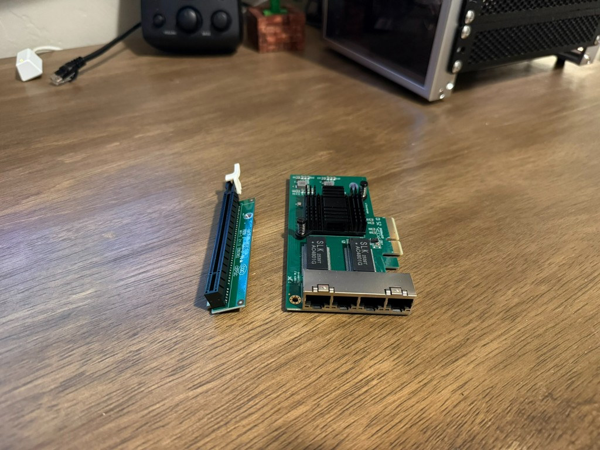

# Hardware

What is in the rack and on the desk, with costs where I paid for them.

## Purchased

| Item | Role | Cost |
| ---- | ---- | ---- |
| DeskPi RackMate T1, 8U, 10 inch | Rack | $119.99 |
| Cat6A keystone coupler, 25 pack | Patch panel jacks | $35.99 |
| Wobeater 01AJ940 expansion riser | PCIe riser in Sirius | $22.49 |
| TP-Link LS108GP | Switch | $59.99 |
| Cat6A 0.5 ft patch cables, 10 pack | Panel to switch | $10.99 |
| Cat6A 2 ft patch cables, 10 pack | Rear device runs | $12.39 |
| Lenovo M720q, i5-9500T, 16 GB, 512 GB NVMe | Polaris chassis | $231.90 |
| Samsung 32 GB (2x16) DDR4-2666 SODIMM | Polaris RAM | $89.97 |
| Lenovo M720q, i5-8400T, 16 GB, 256 GB NVMe | Sirius | $132.49 |
| SK Hynix 32 GB (2x16) DDR4-3200 SODIMM | Vega RAM | $99.51 |
| Lenovo M715q, Ryzen 3 PRO 2200GE, 250 GB 2.5 inch SSD | Vega | $120 |
| 10Gtek 4 port 1 GbE adapter, Intel I350 | Sirius WAN and LAN | $64.99 |

Purchased total: $1000.70

## On hand

| Item | Role |
| ---- | ---- |
| Archer AX6000 | Lyra access point |
| Windows 11 desktop, Ryzen 7 5800X, 32 GB, RTX 3080 Ti, 3 TB+ NVMe | Sol, command center |
| ISP modem | WAN handoff to Sirius |
| Black PETG filament | All printed mounts |

The 10Gtek card is gigabit. The brand name is 10Gtek. Link speed is 1 Gbps.

Polaris shipped with 16 GB. Those sticks came out when the Samsung kit went in. They are spares.

## Hosts

**Sirius** is a Lenovo M720q with an i5-8400T, 16 GB, and a 256 GB NVMe. It runs OPNsense on the metal. The I350 card sits on the Wobeater 01AJ940 riser. Port 1 is WAN. Port 2 is LAN. Ports 3 and 4 and the onboard NIC are unused.

**Polaris** is a Lenovo M720q with an i5-9500T, 32 GB DDR4-2666, and a 512 GB M.2 NVMe. It is the primary Proxmox node. After the NIC moved to Sirius, Polaris uses the onboard Ethernet only.

**Vega** is a Lenovo M715q with a Ryzen 3 PRO 2200GE, 32 GB DDR4-3200, and a 250 GB 2.5 inch SSD. It is the second Proxmox node.

**Sol** is the Windows 11 desktop. It is the admin station. It is not a hypervisor for this lab.

**Lyra** is the Archer AX6000 in access point mode.

## Storage

Polaris uses ZFS on the single NVMe. That gives snapshots and checksums. It does not give redundancy. One disk is one copy.

Vega uses ext4 with LVM-thin on the SATA SSD. After the cluster is up, `local-lvm` is the Vega disk store. `local-zfs` stays on Polaris.

## Mounts

Printed parts, credits, and print notes live in [hardware/mounts](../hardware/mounts/README.md).
