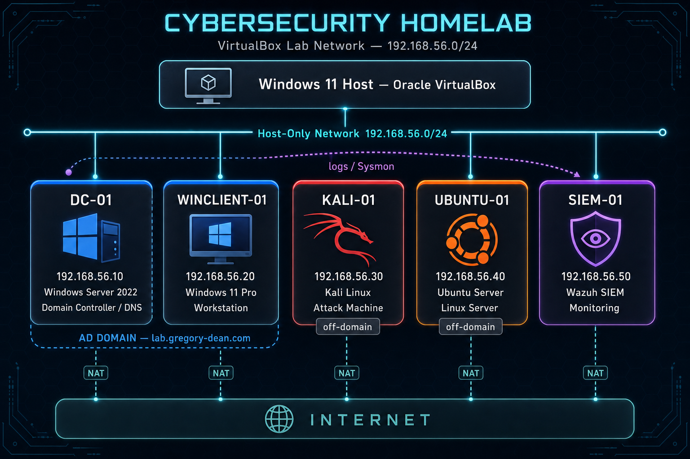

# Lab Architecture

## Overview

This homelab is designed to simulate a small enterprise security environment using VirtualBox on a Windows 11 host.

## System Roles

- **DC-01** — Domain controller providing Active Directory authentication and internal DNS for the lab domain
- **WINCLIENT-01** — Domain-joined workstation for user authentication and Group Policy validation
- **KALI-01** — Off-domain attack simulation machine for offensive security testing
- **UBUNTU-01** — Off-domain Linux server for administration, services, and log generation
- **SIEM-01** — Off-domain monitoring platform running Wazuh for log aggregation, detection, and alerting

For operating system versions, IP addresses, and deployment notes, see [asset-inventory.md](asset-inventory.md).

## Network Design

- Internal subnet: `192.168.56.0/24`
- VirtualBox Host-Only Adapter for internal lab communication
- VirtualBox NAT per VM for outbound internet access

## Goals

- Simulate enterprise user and administrator activity
- Generate realistic Windows and Linux logs
- Practice vulnerability management workflows
- Test attack techniques in a controlled environment
- Develop detection and investigation skills

## Planned Expansion

- Firewall or segmentation layer
- IDS/IPS tooling
- Additional Linux services
- More realistic user activity simulation
- Centralized vulnerability reporting
