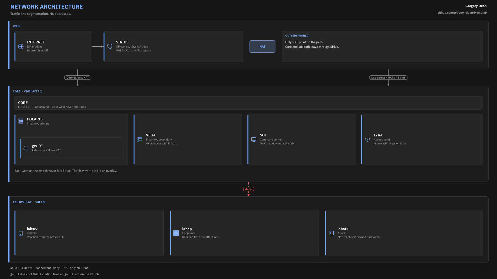

# Network

Addresses, DNS, NIC map, and the patch panel.

The wall-and-gate view of the same path is on [architecture](architecture.md).

## Core (`10.10.10.0/24`)

Physical LAN on the LS108GP. Domain `home.gregory-dean.com`. Sirius is DHCP (Dnsmasq) and DNS (Unbound).

| Address | Name | Device |
| ------- | ---- | ------ |
| `10.10.10.1` | sirius | M720q i5-8400T, OPNsense |
| `10.10.10.2` | lyra | Archer AX6000 |
| `10.10.10.3` | gw-01 | OPNsense VM on Polaris |
| `10.10.10.11` | polaris | M720q i5-9500T, Proxmox |
| `10.10.10.12` | vega | M715q Ryzen 3, Proxmox |
| `10.10.10.154` | sol | Ryzen 7 desktop, DHCP reservation on Sirius |
| `10.10.10.100` to `10.10.10.199` | DHCP pool | Phones, laptops, anything else on Core |

DHCP options: gateway `10.10.10.1`, DNS `10.10.10.1`, NTP `10.10.10.1`, domain `home.gregory-dean.com`. Sol stays on DHCP. Sirius holds a Dnsmasq reservation so Sol always gets `10.10.10.154`. Unbound listens on 53. Dnsmasq listens on 53053 and registers lease names. Unbound forwards `home.gregory-dean.com` to it.

## Lab networks

Virtual. Routed by gw-01. Domain `lab.gregory-dean.com` on `dc-01`.

| Address | Name | VNet | Notes |
| ------- | ---- | ---- | ----- |
| `10.30.10.1` | gw-01 | labsrv | Lab server gateway |
| `10.30.10.10` | dc-01 | labsrv | Windows Server, AD DS |
| `10.30.10.40` | ubuntu-01 | labsrv | Ubuntu Server, off domain |
| `10.30.10.50` | siem-01 | labsrv | Ubuntu Server, Wazuh |
| `10.30.20.1` | gw-01 | labep | Endpoint gateway |
| `10.30.20.20` | winclient-01 | labep | Windows 11 Pro, domain joined |
| `10.30.30.1` | gw-01 | labatk | Attack gateway |
| `10.30.30.30` | kali-01 | labatk | Kali, off domain |

DHCP on each lab net is `x.100` to `x.199` from gw-01.

Workstations use `10.30.10.10` for DNS. Kali uses `10.30.30.1`.

Sirius Unbound forwards `lab.gregory-dean.com` to `10.30.10.10`. gw-01 Unbound does the same. gw-01 DHCP option 6 on LABSRV and LABEP is `10.30.10.10`. LABATK stays on `10.30.30.1`.

## Sirius NIC assignment

10Gtek Intel I350, driver `igb`, plus the onboard NIC.

| Port | Role |
| ---- | ---- |
| I350 port 1 | WAN to the ISP modem |
| I350 port 2 | LAN to the switch, `10.10.10.1` |
| I350 ports 3 and 4 | unused |
| Onboard | unused |

I confirm names (`igb0` and so on) at the console by plugging one cable at a time. The bracket is labeled to match.

## Routes and NAT

On Sirius:

- `10.30.10.0/24` via `10.10.10.3`
- `10.30.20.0/24` via `10.10.10.3`
- `10.30.30.0/24` via `10.10.10.3`
- Hybrid source NAT for `10.10.10.0/24` (automatic) and `10.30.0.0/16` (manual) to WAN

On gw-01: no outbound NAT. Default route `10.10.10.1`.

## Firewall intent

Sirius LAN, first match. Default “allow LAN to any” is disabled. Access to the GUI and SSH is the Sol rule, not a listen-on-LAN bind.

1. Core to Sirius TCP/UDP 53 (Unbound)
2. Core to Sirius UDP 123 (NTP)
3. Core to Sirius ICMP
4. Sol to Sirius TCP 443 and 22
5. Sol to Polaris and Vega TCP 8006, 22, 5900 to 5999
6. Sol to gw-01 TCP 443 and 22
7. Sol to `10.30.0.0/16` any
8. Core to any destination not `10.10.10.0/24` and not `10.30.0.0/16` (house internet)
9. Lab prefixes to any destination not Core (lab internet)
10. Deny the rest inbound to Sirius

gw-01 is the zone break:

- Sol may enter the lab
- Other Core clients may not
- Sirius ICMP to gw-01 for route monitoring
- Sirius DNS (TCP/UDP 53) to `dc-01` so Unbound can answer lab names on Core
- Lab nets may not initiate to Core
- `labatk` may reach `labsrv` and `labep` (that is the point)

## Patch panel and switch

Rear of the panel is permanent. Front cords are 0.5 ft Cat6A to the switch. Rear runs are 2 ft Cat6A.

| Panel | Switch | Device |
| ----- | ------ | ------ |
| 1 | 1 | Sirius LAN |
| 2 | 2 | Polaris |
| 3 | 3 | Vega |
| 4 | 4 | Sol |
| 5 | 5 | Lyra |
| 6 to 12 | 6 to 8 | open |

LS108GP: Extend mode off. PoE Auto Recovery off. Lyra uses its own power brick, so PoE is unused.

## VXLAN

Zone id `lab` on both Proxmox nodes. Peers `10.10.10.11` and `10.10.10.12`. MTU 1450. VNets `labsrv`, `labep`, `labatk`. I do not create extra Linux bridges for the lab. A bridge with no NIC would be local to one node.
