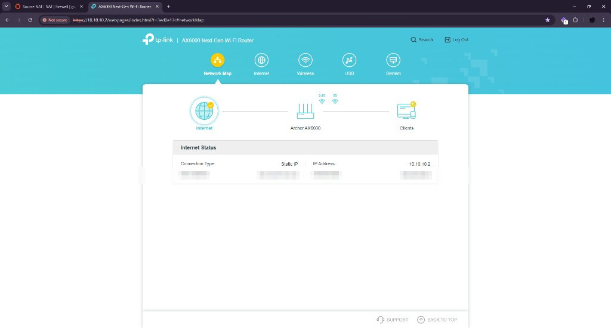

# Access point

Lyra is an Archer AX6000 running in access point mode. It is house WiFi, not a second router.

Sirius must stay the only DHCP server on Core. If a phone ever shows `192.168.0.x` or `192.168.1.x`, unplug Lyra and fix DHCP before anything else.

## Mode

Do this from Sol on Ethernet, not from a phone on WiFi.

1. Open the current Lyra address. Fresh firmware often answers at `http://tplinkwifi.net`. After it is on Core, Sirius **Services → Dnsmasq DNS & DHCP** leases will show it.
2. **Advanced → System → Operation Mode** is Access Point. If it is still Router, convert it before you leave it on Core.
3. DHCP on Lyra is off. AP mode usually removes the page. If a DHCP page is still there, turn it off.
4. Guest network off. A guest SSID on this switch is still Core L2. It would not isolate phones from Sol.
5. IPTV / VLAN off.

## Lock `10.10.10.2`

1. On Sirius, **Services → Dnsmasq DNS & DHCP → Hosts**: reservation `lyra` → `10.10.10.2`. Keep it **outside** the `100`–`199` pool. Dnsmasq wants colons in the MAC, not Windows dashes. The Unbound host override for `lyra.home.gregory-dean.com` should already exist from the [firewall](firewall.md) guide.
2. On Lyra, set LAN IPv4 **static** `10.10.10.2`, mask `255.255.255.0`, gateway `10.10.10.1`, DNS `10.10.10.1`. Save. It may reboot.
3. After it returns: from Sol, `ping -n 4 10.10.10.2` and open `http://10.10.10.2` (or HTTPS if that firmware uses it).
4. If the UI dies and a phone still has WiFi, Lyra took a different address. Check Sirius leases, then set static again.

Change the admin password if it is still the TP-Link default.

## Cable

The uplink is a 2 ft Cat6A from a Lyra LAN port to patch panel port 5, then to switch port 5. I prefer LAN after the reboot into AP mode. WAN stays empty.

Lyra uses its own brick. Do not move it to PoE on the LS108GP.

## Wireless

I keep the existing 2.4 GHz and 5 GHz names and passwords. House clients should not have to rejoin. 

There is no guest VLAN on this switch. I leave guest off.

## Checks

- Lyra answers at `http://10.10.10.2` from Sol
- `nslookup lyra.home.gregory-dean.com` from Sol returns `10.10.10.2`
- A phone on WiFi gets a `10.10.10.1xx` address, gateway `10.10.10.1`, DNS `10.10.10.1`
- Internet works on WiFi
- That phone cannot open `https://10.10.10.3` (gw-01 WAN deny, not Lyra)
- No second DHCP server: a phone never gets `192.168.x.x` while on this SSID

Lyra is not the edge. It does not NAT. It does not hand out `192.168` addresses. Phones on WiFi can reach the internet and can reach Sol. They cannot reach the lab, because gw-01 denies Core (other than Sol) from entering `10.30.0.0/16`.