# Firewall

There are two OPNsense installs. Only Sirius is a box in the rack. Build Sirius first. Build gw-01 after both Proxmox nodes are clustered and the VXLAN vnets exist. That part of [hypervisor](hypervisor.md) has to come first.

As-built on OPNsense 26.7. 26.7 uses Dnsmasq for DHCP, Source NAT instead of the old Outbound page, and Firewall → Rules as the MVC editor. ISC DHCP is end-of-life. Do not enable Kea.

I export `config.xml` after every change session (**System → Configuration → Backups**).

## Sirius (M720q i5-8400T)

Physical edge. WAN from the ISP modem on I350 port 1. LAN `10.10.10.1` on I350 port 2 into the switch.

### USB and install

1. On Sol, download the current OPNsense amd64 **vga** image (`OPNsense-*-vga-amd64.img.bz2`) from [opnsense.org/download](https://opnsense.org/download/). A DVD ISO in Rufus DD mode also works. vga is the project's USB path.
2. Verify SHA256 of the `.bz2` against the current 26.7 release notes. Extract with 7-Zip before writing.
3. Write the USB with Rufus in **DD Image** mode. Not ISO mode.
4. Sirius: F12 boot menu, USB, UEFI. Skip the config importer. Log in as `installer` / `opnsense`.
5. Install (UFS) to `nvd0` (256 GB NVMe), not `da0` (the stick). Recommended swap (8 GB). UFS is the simple choice on a single disk firewall.
6. Set a strong root password. Reboot and remove the USB.

### Assign interfaces

Do this at the console with cables as the guide. `igb` numbers are not guaranteed to match bracket order.

1. Unplug every ethernet cable from Sirius.
2. Plug the modem into I350 port 1. Watch the console link status. Note which `igb` device came up. That is WAN.
3. Move that cable to I350 port 2 and note the device. That is LAN.
4. Menu 1: no VLANs. Assign only WAN and LAN. Leave I350 ports 3 and 4 and the onboard NIC unassigned.
5. Menu 2: LAN `10.10.10.1/24`, IPv6 no, DHCP `10.10.10.100` to `10.10.10.199`. Keep the GUI on HTTPS.
6. Plug modem into port 1, switch into port 2. Connect Sol to the switch. Sol should pull a `10.10.10.1xx` address. Only one DHCP server on Core. The modem and Lyra must not serve DHCP.
7. Label the I350 bracket: port 1 WAN, port 2 LAN.

GUI is `https://10.10.10.1`, user `root`. Accept the self-signed cert for this host only.

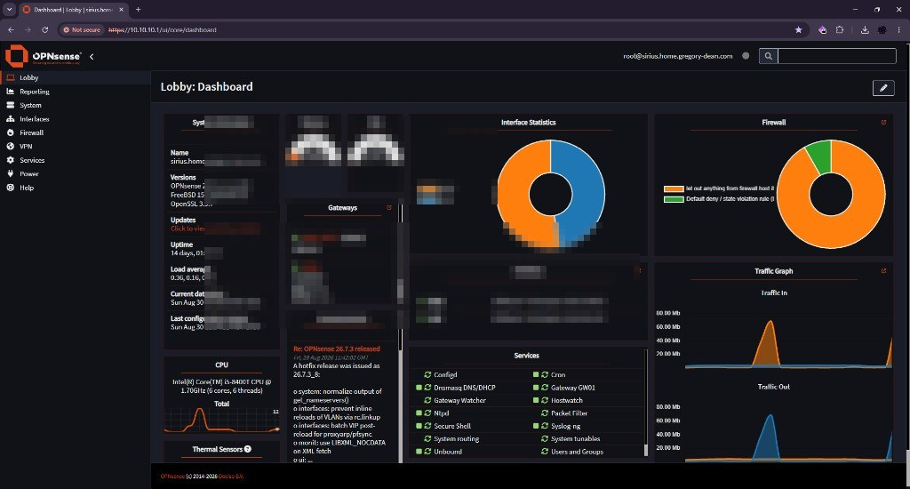

### Firmware and general

**System → Firmware → Status → Check for updates** before a long config session. Reboot. Confirm the dashboard shows 26.7.2 or later.

**System → Settings → General**

- Hostname `sirius`
- Domain `home.gregory-dean.com`
- DNS servers left empty. Unbound handles resolution
- Allow DNS server list to be overridden by DHCP/PPP on WAN: **off**
- Do not use the local DNS service as a nameserver: **off**
- Timezone `America/Boise`
- Prefer IPv4 over IPv6: on

### WAN and LAN

WAN:

- IPv4 via DHCP
- If WAN comes up RFC1918, the modem is still NATing. Put the modem in bridge mode. Do not publish the public WAN address.
- IPv6: none
- Block bogon networks: on
- Block private networks: on
- No DHCP server on WAN

LAN:

- IPv4 static `10.10.10.1/24`
- IPv6 none
- Block private / bogon: off

### DHCP (Dnsmasq)

**Services → Dnsmasq DNS & DHCP → General**

- Enable on
- Listen port `53053`
- Interface LAN
- Do not forward to system defined DNS servers: on
- DHCP fqdn: on
- DHCP register firewall rules: on
- DHCP default domain empty (uses `home.gregory-dean.com`)

**DHCP ranges:** delete leftover `192.168.1.100–199` or IPv6/RA ranges. LAN range `10.10.10.100` to `10.10.10.199`, domain `home.gregory-dean.com`. Router and DNS options are automatic (`10.10.10.1`).

**DHCP options:** set `ntp-server[42]` to `10.10.10.1` on LAN.

**Hosts** (reservations). Put them in as each device comes online. Dnsmasq wants colons in the MAC.

| Name | Address | Notes |
| ---- | ------- | ----- |
| lyra | `10.10.10.2` | Outside the pool |
| gw-01 | `10.10.10.3` | Outside the pool. Add the Proxmox net0 MAC later |
| polaris | `10.10.10.11` | Outside the pool |
| vega | `10.10.10.12` | Outside the pool |
| sol | `10.10.10.154` | Inside the pool. Windows stays on DHCP |

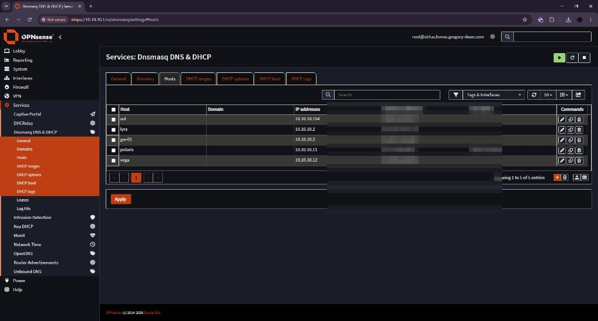

### Unbound DNS

**Services → Unbound DNS → General:** enable, listen port 53, interfaces All, DNSSEC on. Leave ISC lease registration off.

**DNS over TLS** (Domain empty = catch-all):

- `1.1.1.1` port 853, Verify CN `cloudflare-dns.com`
- `9.9.9.9` port 853, Verify CN `dns.quad9.net`

Do not also add a catch-all under Query Forwarding.

**Query Forwarding** to Dnsmasq for Core names and PTRs:

- `home.gregory-dean.com` → `127.0.0.1` port `53053`
- `10.10.10.in-addr.arpa` → `127.0.0.1` port `53053`

Delete leftover `192.168.1` / `lan.internal` forwards from the default image.

**Host overrides** under `home.gregory-dean.com`: sirius `10.10.10.1`, lyra `10.10.10.2`, gw-01 `10.10.10.3`, polaris `10.10.10.11`, vega `10.10.10.12`, sol `10.10.10.154`.

**Advanced → Private Domains:** `home.gregory-dean.com` and `lab.gregory-dean.com`. Rebind protection would strip RFC1918 answers otherwise.

**System → Settings → Administration → Alternate Hostnames:** `sirius.home.gregory-dean.com`.

After `dc-01` exists: Query Forwarding `lab.gregory-dean.com` → `10.30.10.10` port 53. Not before. Unbound would SERVFAIL. The same day, add the gw-01 WAN pass `SIRIUS` → `DC` TCP/UDP 53. Sirius is Core. The `CORE_NET` deny otherwise drops that forward.

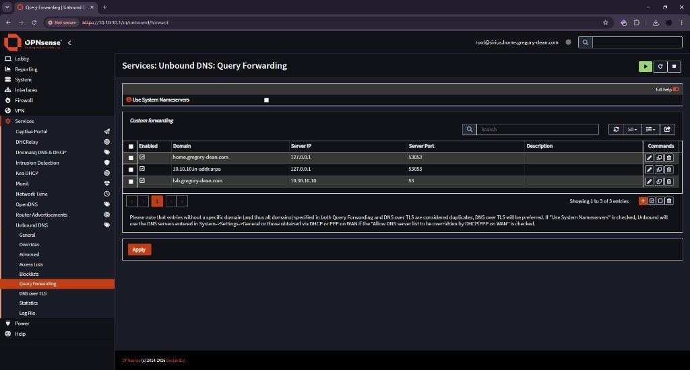

### NTP

Leave **Services → Network Time** enabled. Upstream stays the OPNsense pool. Core clients use `10.10.10.1` via DHCP option 42.

### Aliases

**Firewall → Aliases**

| Name | Type | Content |
| ---- | ---- | ------- |
| `SOL` | Host(s) | `10.10.10.154` |
| `HYPERVISORS` | Host(s) | `10.10.10.11`, `10.10.10.12` |
| `LAB_GW` | Host(s) | `10.10.10.3` |
| `CORE_NET` | Network(s) | `10.10.10.0/24` |
| `LAB_NETS` | Network(s) | `10.30.0.0/16` |
| `HOME_AND_LAB` | Network(s) | `10.10.10.0/24`, `10.30.0.0/16` |
| `HTTPS_SSH` | Port(s) | `443`, `22` |
| `PVE_ADMIN` | Port(s) | `8006`, `22`, `5900:5999` |

`HOME_AND_LAB` exists so one invert can mean “the internet.”

### Static routes

**System → Gateways → Configuration:** name `GW01`, interface LAN, IPv4 `10.10.10.3`, upstream **off**, **Disable Gateway Monitoring** on until gw-01 exists. If monitoring stays on, OPNsense marks the gateway down and withdraws the routes. Leave it off until gw-01 has the Sirius ICMP pass.

**System → Routes → Configuration** via `GW01`:

- `10.30.10.0/24`
- `10.30.20.0/24`
- `10.30.30.0/24`

These do nothing until gw-01 boots. Add them now so the lab works the moment it does.

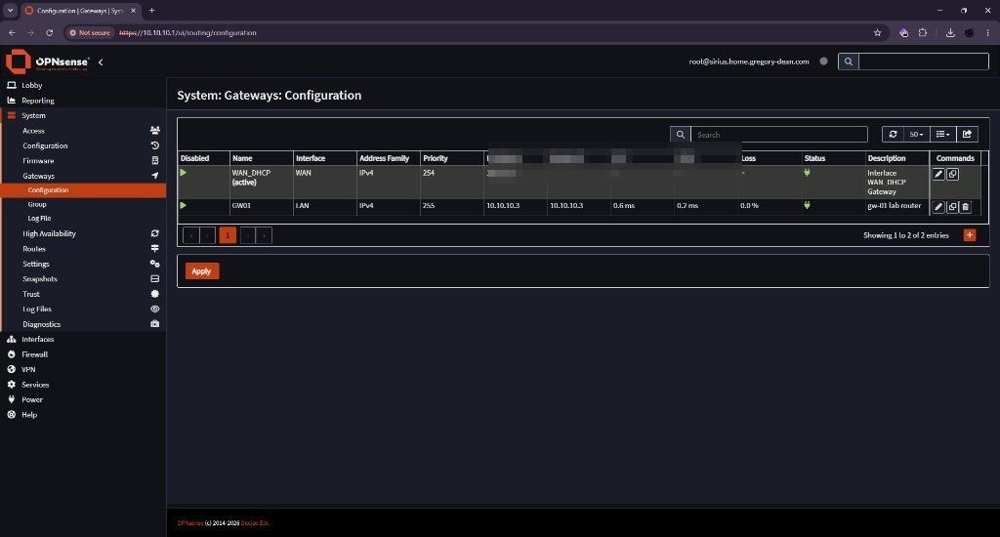

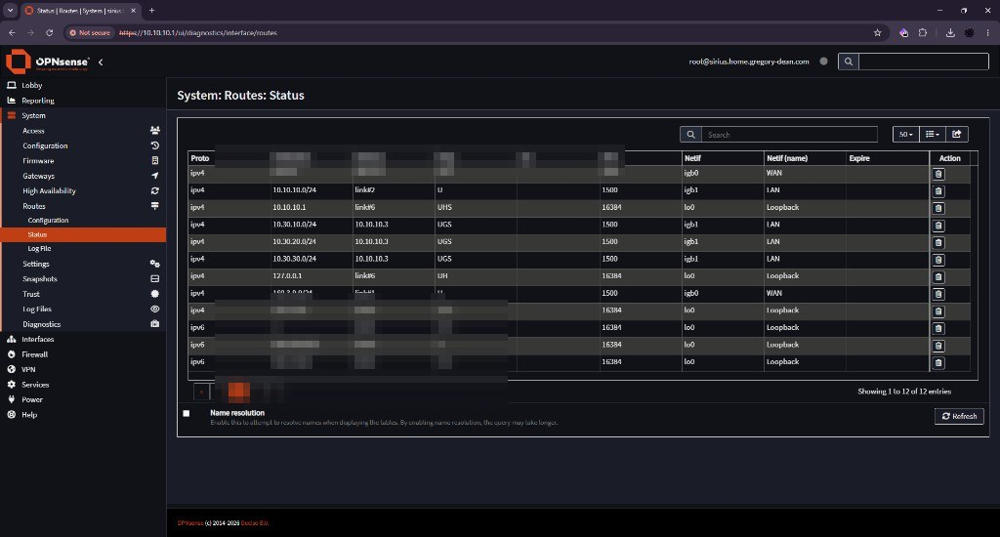

### NAT

**Firewall → NAT → Source NAT**

- Mode: **Hybrid**
- Manual rule: source `LAB_NETS` (`10.30.0.0/16`) out WAN, translate to WAN address. gw-01 does not NAT, so lab sources arrive here unchanged.
- Automatic hybrid already NATs `10.10.10.0/24`
- No port forwards

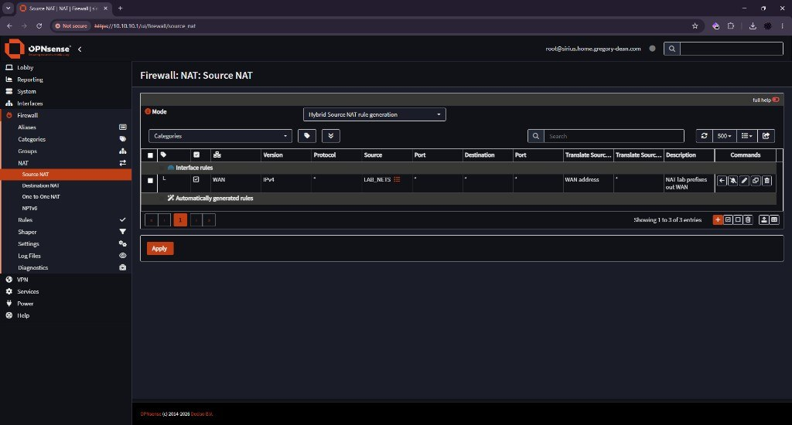

### WAN and LAN rules

WAN: default deny covers inbound. Add nothing. No WAN management. No ICMP from the internet.

**Firewall → Rules**, filter LAN. 26.7 MVC. First match wins (**Quick** on). Direction **in**. Version **IPv4**. Source Port almost always **any**. Interface must be **LAN**, not **any**.

Leave automatically generated rules (anti-lockout, DHCP). Add the custom rules **while** the default “allow LAN to any” IPv4 rule is still enabled, test, then disable both default LAN allows (IPv4 and IPv6). Click **Apply** or pf is still on the old set.

Do not set Source Port to 53 or 123. That is the client’s ephemeral port. Match **Destination Port**.

If **This Firewall** is missing from the dropdown, use **LAN address**.

| # | Protocol | Source | Dest | Dest port | Description |
| - | -------- | ------ | ---- | --------- | ----------- |
| auto | | | | | Anti-lockout. Leave it. |
| 1 | TCP/UDP | `CORE_NET` | This Firewall | DOMAIN (53) | Core DNS to Sirius |
| 2 | UDP | `CORE_NET` | This Firewall | NTP (123) | Core NTP to Sirius |
| 3 | ICMP | `CORE_NET` | This Firewall | (none) | Core ping Sirius |
| 4 | TCP | `SOL` | This Firewall | `HTTPS_SSH` | Sol to Sirius UI and SSH |
| 5 | TCP | `SOL` | `HYPERVISORS` | `PVE_ADMIN` | Sol to Proxmox UI SSH VNC |
| 6 | TCP | `SOL` | `LAB_GW` | `HTTPS_SSH` | Sol to gw-01 UI and SSH |
| 7 | **any** | `SOL` | `LAB_NETS` | any | Sol into lab nets |
| 8 | any | `CORE_NET` | **invert** `HOME_AND_LAB` | any | Core to internet only |
| 9 | any | `LAB_NETS` | **invert** `CORE_NET` | any | Lab to internet not Core |

Gateway on all of these: **None**. Rule 7 must be protocol **any**, not TCP.

Without 1–3, disabling the default LAN allow breaks DNS and NTP for the whole house, including Sol.

Rule 8 is house internet. Core may go anywhere except Core and lab, so Lyra clients are not routed into `10.30.0.0/16`.

Rule 9 is lab internet through Sirius NAT. It does not stop `kali-01` from reaching Sol. That traffic never touches Sirius because gw-01 and Sol share the same L2. The deny lives on gw-01.

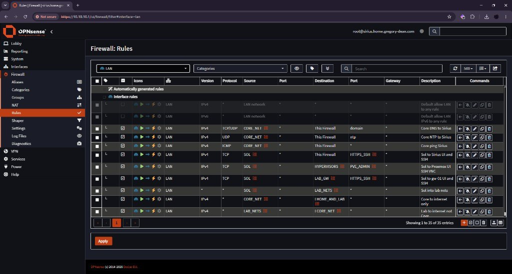

### Admin hardening

**System → Settings → Administration**

- Web UI HTTPS. Listen interfaces **All**. OPNsense warns that binding to LAN only is a lockout. WAN is already default deny. Sol-only LAN rules are the real control.
- SSH on. Permit root login on. Permit password login **on until the key works**. Listen All. Port 22.

Paste the Sol public key into **System → Access → Users → root → Authorized keys**. Test `ssh root@10.10.10.1`. Then disable password login. Keep a console session on the Tiny until key login works.

UPnP off. Do not install it.

### Sirius checks

- Sol has `10.10.10.154` with gateway and DNS `10.10.10.1`
- `nslookup sirius.home.gregory-dean.com` and `nslookup polaris.home.gregory-dean.com` from Sol
- Internet works from Sol
- Web UI reachable at `https://10.10.10.1` from Sol after the default LAN allow is disabled
- `ssh root@10.10.10.1` is key only

Sirius cannot filter Sol from gw-01. They share Core L2. Isolation for the cyber range is the other OPNsense.

## gw-01 (VM on Polaris)

Create the VM in [hypervisor](hypervisor.md) first. Four virtio NICs: `vmbr0` Core, then `labsrv`, `labep`, `labatk`.

WAN is Core. Fresh OPNsense treats it like the internet: block-private on, default deny, reply-to the WAN gateway. Apply and console menu 2 re-enable pf. Create the `SOL` alias and a WAN pass for Sol **before** pf stays on, or the Sol session drops.

Unlock from the **gw-01** console (Proxmox noVNC → menu 8), not from Polaris:

```bash
pfctl -d
ifconfig vtnet0
```

`vtnet0` must show `inet 10.10.10.3`. A pool address (`10.10.10.100`–`199`) means DHCP won. Set WAN to Static again. Then `https://10.10.10.3` from Sol, add the Sol WAN pass, **Firewall → Settings → Advanced → Disable reply-to**, Apply, `pfctl -e`. Confirm the GUI still loads with pf enabled.

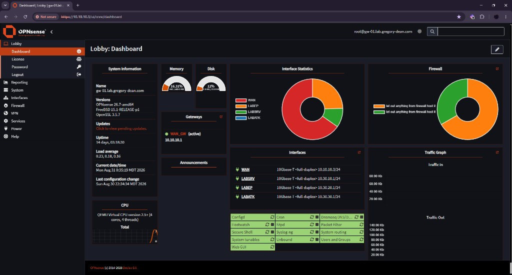

26.7 MVC rules cannot take a raw IP in Source or Destination. Create aliases first. Search the alias name, not `10.10.10.154`.

### Interfaces

vtnet order follows net0 to net3. Confirm MACs against the Proxmox NIC list.

- WAN = vtnet0 (Core uplink): **Static** `10.10.10.3/24`, upstream gateway `10.10.10.1`, no DHCP client, no DHCP server, IPv6 none. Block private networks **off**. Block bogons **off**.
- OPT1 rename LABSRV = vtnet1: `10.30.10.1/24`, DHCP `10.30.10.100` to `10.30.10.199`
- OPT2 rename LABEP = vtnet2: `10.30.20.1/24`, DHCP `10.30.20.100` to `10.30.20.199`
- OPT3 rename LABATK = vtnet3: `10.30.30.1/24`, DHCP `10.30.30.100` to `10.30.30.199`

System settings: hostname `gw-01`, domain `lab.gregory-dean.com`, timezone `America/Boise`.

Unbound on gw-01: listen on the three lab interfaces. Query forwarding to `10.10.10.1`. Do **not** add a domain override for `lab.gregory-dean.com` to `10.30.10.10` until the DC exists.

NAT: Source NAT (Outbound) mode **Disable**. gw-01 is a router. Sirius does the NAT.

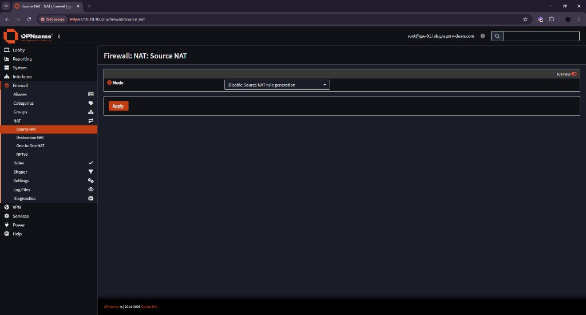

**Firewall → Settings → Advanced → Disable reply-to** on. WAN and Sol share Core L2. Reply-to `WAN_GW` (`10.10.10.1`) breaks the Sol GUI even when the pass rule matches. Sirius keeps reply-to. Its WAN is public.

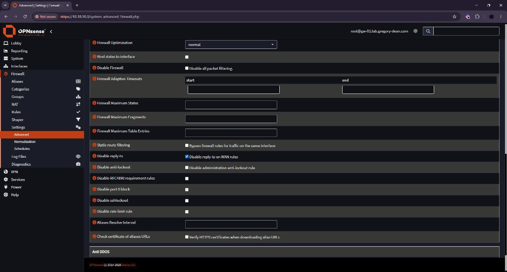

Add the gw-01 net0 MAC to the Sirius Dnsmasq host reservation for `10.10.10.3` so DHCP cannot hand out a pool address again.

Turn Sirius gateway `GW01` monitoring on only after Sirius **Interfaces → Diagnostics → Ping** to `10.10.10.3` works. That needs the `SIRIUS` WAN pass below. If monitoring is on and the ping fails, OPNsense marks `GW01` down and withdraws the `10.30` routes.

### gw-01 aliases

- `SOL` host `10.10.10.154`
- `SIRIUS` host `10.10.10.1`
- `CORE_NET` network `10.10.10.0/24`
- `LABSRV_NET` network `10.30.10.0/24`
- `LABEP_NET` network `10.30.20.0/24`
- `LABATK_NET` network `10.30.30.0/24`
- `DC` host `10.30.10.10`
- `SIEM` host `10.30.10.50`

### gw-01 rules

WAN (the Core uplink), in order:

1. Allow source `SOL` to any (admin plus jump into the lab)
2. Allow source `SIRIUS` to This Firewall, ICMP (Sirius `GW01` monitor). The `CORE_NET` deny also matches `10.10.10.1`.
3. Allow source `SIRIUS` to `DC`, TCP/UDP 53 (Sirius Unbound → `dc-01`). Add this when the DC exists.
4. Deny source `CORE_NET` to any (phones and house devices stay out of the lab)

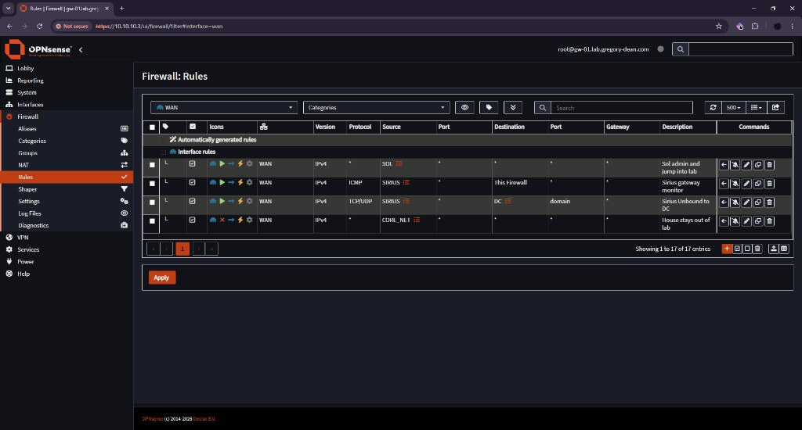

LABSRV, in order:

1. Allow to `LABEP_NET` any (AD, GPO, SMB)
2. Allow to `LABSRV_NET` any (server to server, SIEM agents)
3. Block to `CORE_NET` any
4. Block to `LABATK_NET` any (servers do not initiate toward Kali)
5. Allow to any (internet via Sirius)

LABEP, in order:

1. Allow to `DC` any (domain join first build)
2. Allow to `SIEM` any (Wazuh agent)
3. Allow to `LABSRV_NET` any
4. Block to `CORE_NET` any
5. Block to `LABATK_NET` any
6. Allow to any (internet)

LABATK, in order:

1. Block to `CORE_NET` any (the rule that protects Sol, the hypervisors, Lyra, and anything personal on Core)
2. Allow to `LABSRV_NET` any
3. Allow to `LABEP_NET` any
4. Allow to any (tools and updates)

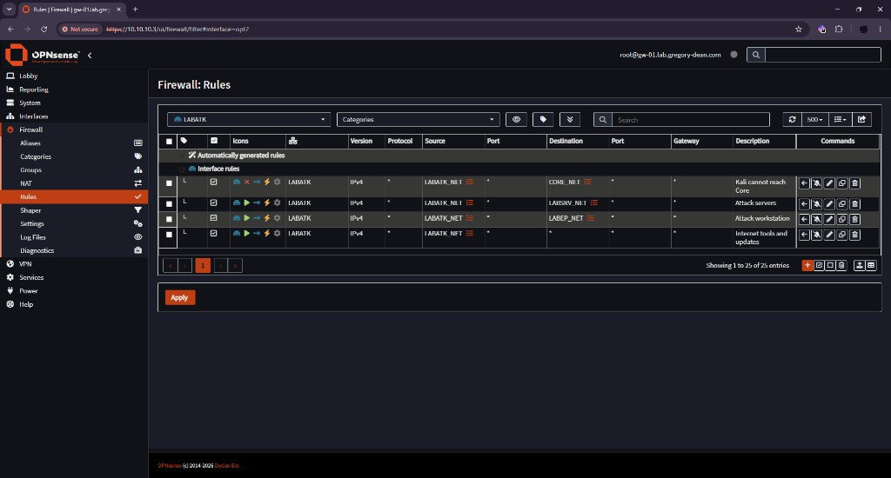

Block rules sit above the allows they override. Review order after saving. OPNsense evaluates top down. First match wins.

### DHCP DNS after the DC

On gw-01 **Services → Dnsmasq DNS & DHCP → DHCP options → +**: `dns-server[6]` = `10.30.10.10` on LABSRV and LABEP. The options table starts empty. There is nothing to edit. Do not change LABATK. Kali stays on `10.30.30.1`.

Same day on gw-01 Unbound: query forwarding `lab.gregory-dean.com` → `10.30.10.10`.

### gw-01 checks

From Sol:

- `ping 10.10.10.3` answers
- `ping 10.30.10.1` answers (Sirius static routes plus gw-01)
- `ping 10.30.20.1` and `ping 10.30.30.1` answer
- `https://10.10.10.3` opens from Sol with pf enabled
- A phone on Lyra cannot open `https://10.10.10.3`

From Sirius: Diagnostics ping to `10.10.10.3` replies. **System → Gateways → Status** shows `GW01` Online. **System → Routes → Status** shows the three `10.30` prefixes via `10.10.10.3`.

Expected non-issues: `vxlan_*` UNKNOWN. gw-01 cannot ping Polaris. The datacenter firewall has no ICMP allow. That is not a broken overlay.

If Sol cannot ping `10.30.10.1`, check Sirius routes, `GW01` not down, gw-01 WAN gateway, and that NAT is disabled on gw-01. If Sol cannot open the GUI with pf on, check Disable reply-to and that WAN is still Static `.3`.
