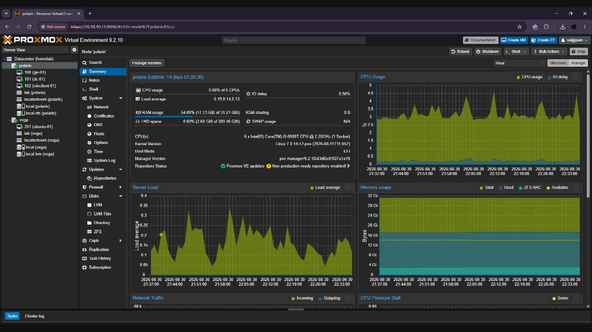
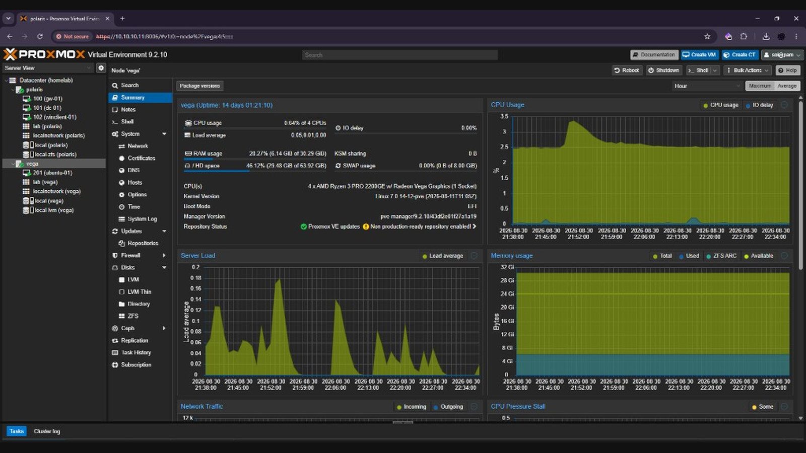
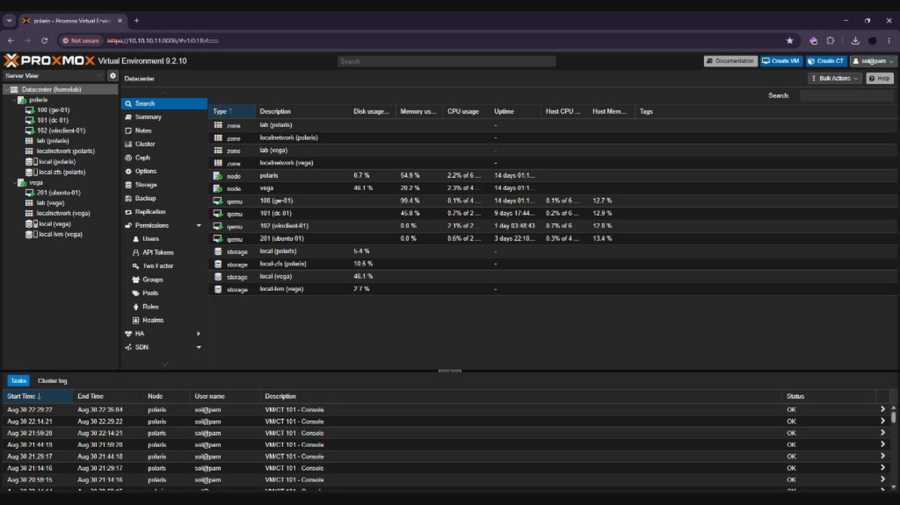
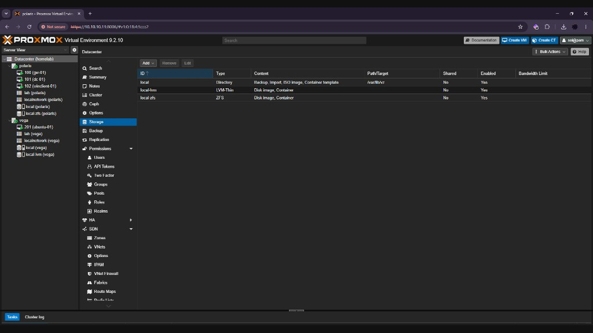
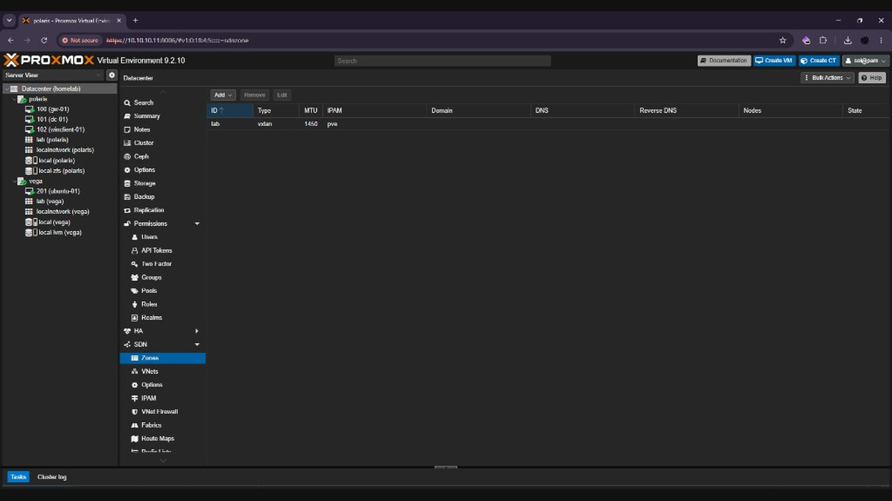
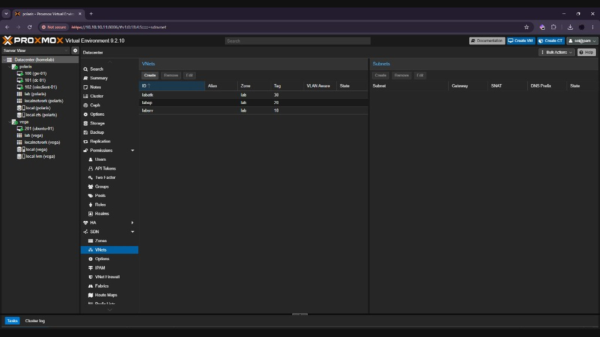
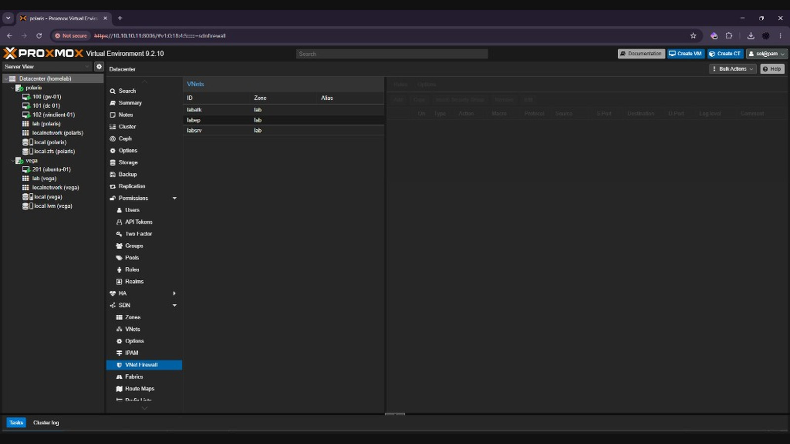

# Hypervisor

Two Proxmox nodes, one UI, no shared storage, no HA.

Sirius has to be up first. Both nodes need Core addresses and DNS at `10.10.10.1`.

## Polaris (M720q i5-9500T)

Primary node. 32 GB DDR4-2666. 512 GB M.2 NVMe on ZFS, single disk.

ZFS here is for snapshots and checksums. It is not a mirror. If the NVMe dies, those guests die with it.

### Install

1. On Sol, download the current Proxmox VE ISO and verify the SHA256.
2. Write USB with Rufus in dd mode. Boot Polaris from it.
3. Target disk: the 512 GB NVMe. Options, filesystem ZFS RAID0, single disk.
4. Country United States, timezone `America/Boise`, then keyboard.
5. Set a strong root password. The installer email field is for Proxmox alerts.
6. Network:
   - Interface: the onboard NIC
   - Hostname `polaris.home.gregory-dean.com`
   - IP `10.10.10.11/24`
   - Gateway `10.10.10.1`
   - DNS `10.10.10.1`
7. Finish, reboot, remove USB.

### First boot

SSH from Sol: `ssh root@10.10.10.11`

1. Repositories: disable `pve-enterprise`, enable the no subscription repo. In the UI this is under the node, **Updates → Repositories**. No Ceph repos. I do not run Ceph.
2. `apt update` then `apt dist-upgrade`, reboot.
3. Timezone `America/Boise`. NTP to `10.10.10.1`. Cluster and AD both care about the clock.
4. Confirm `/etc/network/interfaces` has a single bridge:

```text
auto vmbr0
iface vmbr0 inet static
    address 10.10.10.11/24
    gateway 10.10.10.1
    bridge-ports enp1s0
    bridge-stp off
    bridge-fd 0
```

Interface name may differ. Check with `ip link`. Do not make `vmbr0` VLAN aware. Tagged frames would go to the unmanaged switch and die.

5. Static map on Sirius: add the Polaris MAC to the `10.10.10.11` reservation.

Checks: UI at `https://10.10.10.11:8006` from Sol. `zpool status` shows the single disk pool healthy. `free -h` shows around 31 GB total.



Guests on this node: `gw-01`, `dc-01`, `winclient-01`, `siem-01`.

## Vega (M715q Ryzen 3 PRO 2200GE)

Second node. 32 GB DDR4-3200. 250 GB SATA SSD with ext4 and LVM-thin.

### Install

Same ISO and USB as Polaris.

1. Target disk: the 250 GB SATA SSD. Filesystem ext4 with LVM-thin (the installer default). Simpler than ZFS on the smaller disk and leaves more RAM for guests.
2. Hostname `vega.home.gregory-dean.com`
3. Timezone `America/Boise`
4. IP `10.10.10.12/24`, gateway `10.10.10.1`, DNS `10.10.10.1`
5. Finish, reboot, remove USB.

### First boot

SSH from Sol: `ssh root@10.10.10.12`

1. Repositories: same as Polaris, no subscription repo only.
2. `apt update` then `apt dist-upgrade`, reboot.
3. Timezone `America/Boise`. NTP to `10.10.10.1`. Confirm the clock matches Polaris.
4. Confirm `vmbr0` on the onboard NIC, static `10.10.10.12/24`, `bridge-stp off`, `bridge-fd 0`, not VLAN aware.
5. Static map on Sirius: add the Vega MAC to the `10.10.10.12` reservation.

Checks: UI at `https://10.10.10.12:8006`. `pvesm status` shows `local` and `local-lvm`. Both nodes can ping each other. Sol does not answer ping.



Guests on this node: `ubuntu-01` and `kali-01`.

## Cluster

Cluster name `homelab`. Created on Polaris, Vega joined. Corosync rides `vmbr0`.

On Polaris:

```bash
pvecm create homelab
```

On Vega:

```bash
pvecm add 10.10.10.11
```

Confirm with `pvecm status` on either node. Both nodes now show in one UI at `https://10.10.10.11:8006`.



No HA. Two nodes have no tiebreaker vote. If one node dies the survivor can lose quorum and refuse changes. Recovery on the live node:

```bash
pvecm expected 1
```

Storage definitions replicate. `local-zfs` is Polaris `rpool`. After Vega joins it appears on Vega and is inactive (`cannot import 'rpool'`). **Datacenter → Storage → local-zfs → Edit → Nodes:** `polaris` only.

Vega’s thin pool is `pve/data`. If **Datacenter → Storage** has no `local-lvm` for Vega, **Add → LVM-Thin**, ID `local-lvm`, node `vega`, VG `pve`, thin pool `data`. Confirm with `pvesm status` and `lvs` on Vega. Do not put Vega guests on `local-zfs`. Create fails with `cannot import 'rpool'`.

ISOs for Vega guests go to `local` on Vega. Polaris `local` is not visible there.



## Datacenter firewall

**Datacenter → Firewall**. Order matters. Create the rules before enabling, or the UI session drops.

1. IPSets: `sol` containing `10.10.10.154`, and `pve_peers` containing `10.10.10.11` and `10.10.10.12`.
2. Rules, direction IN, action ACCEPT:
   - source `+sol`, dest ports 8006 and 22, TCP
   - source `+pve_peers`, UDP 5404 to 5405 (corosync)
   - source `+pve_peers`, UDP 4789 (VXLAN)
   - source `+pve_peers`, TCP 8006, 22, 3128, 5900 to 5999, 60000 to 60050 (UI proxy, SSH, spice, console, migration)
3. Input policy DROP, output policy ACCEPT.
4. Enable firewall at datacenter level, then on both nodes.
5. Confirm the UI still loads from Sol and `pvecm status` still shows both votes. If corosync drops, the peer rule is wrong. Fix before continuing.

A phone on Core should not open `https://10.10.10.11:8006` after this is on.

That page is **Datacenter → Firewall** (Options, IPSet, Rules). It is not **SDN → VNet Firewall**.

## SDN overlay

**Datacenter → SDN**

1. Zones: add a VXLAN zone, ID `lab`, peers `10.10.10.11` and `10.10.10.12`, MTU 1450.
2. VNets: add three, all in zone `lab`, no subnets defined on the Proxmox side (gw-01 owns the gateways):
   - `labsrv`
   - `labep`
   - `labatk`
3. Apply. Check both nodes show the vnets under their network lists. `vxlan_*` operstate `UNKNOWN` with `UP,LOWER_UP` is normal. The Proxmox `localnet` zone can stay. Do not put guests on it.





I leave **Datacenter → SDN → VNet Firewall** empty. Isolation is gw-01, not a Proxmox VNet rule.



Do not create extra Linux bridges for the lab. A bridge with no physical NIC is local to one node. The VXLAN zone is what lets a guest on Vega talk L2 to a guest on Polaris.

Guest MTU: 1450. Set it in the guest NIC config (tick Advanced) or leave Proxmox to propagate it.

## gw-01 VM

Create on Polaris. OPNsense config is in [firewall](firewall.md). This section is only the VM.

- VM ID 100, name `gw-01`
- OS: OPNsense **dvd** ISO (amd64), same 26.7 major as Sirius. Upload to Polaris `local` from Sol. Not the vga USB image.
- Machine q35, BIOS SeaBIOS
- 32 GB disk, virtio SCSI, on `local-zfs`
- 4 vCPU, type host
- 4 GB RAM, ballooning off. 2 GB was not enough. The guest sat at 99% RAM.
- net0 virtio on `vmbr0`
- net1 virtio on `labsrv`
- net2 virtio on `labep`
- net3 virtio on `labatk`
- QEMU guest agent on
- Options: start at boot on, start order 1
- Options → Firewall **No**

Install OPNsense in the VM the same way as Sirius (GPT, UFS). Then go back to [firewall](firewall.md) for interfaces, reply-to, aliases, and rules.

## Admin habits

I work from Sol at `https://10.10.10.11:8006`. Guest agent on. virtio SCSI, not VirtIO Block and not IDE for the OS disk. CPU type host. Lab NIC MTU 1450. Windows guests use OVMF. `gw-01` uses SeaBIOS. Guest firewall stays off unless I add rules.

Repos are the no subscription list. No Ceph.
