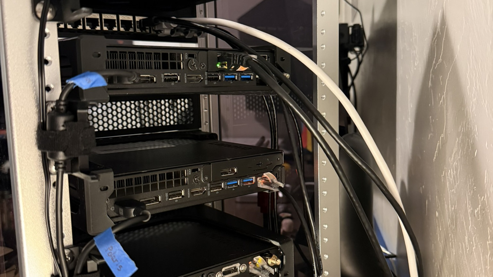

# Rack

The lab uses a GeeekPi / DeskPi RackMate T1, 8U, 10 inch wide.

## What sits in it

From the top of the cabinet:

- TP-Link LS108GP in a 1U printed tray
- 12 port keystone panel, 0.5U print
- Sirius, Lenovo M720q i5-8400T, OPNsense, 1U printed Tiny tray
- 1U perforated blank
- Polaris, Lenovo M720q i5-9500T, Proxmox, 1U printed Tiny tray
- 1U perforated blank
- Vega, Lenovo M715q Ryzen 3 PRO 2200GE, Proxmox, 1U printed Tiny tray
- 1.5U perforated blank at the bottom

The blanks sit between the Tinys and fill the last space in the cabinet. Network diagrams still show traffic order, Sirius then the switch. This elevation is the physical stack.

## Prints

All current prints are black PETG. Tiny trays are [owlish's m720q mount](https://www.printables.com/model/1384009-10-inch-rack-mount-for-lenovo-thinkcentre-m920q-m7). The panel is [Juraj's MiniRack keystone panel](https://www.printables.com/model/1316293-minirack-10-inch-blank-keystone-patch-panel). The switch tray is my own file.

Print notes and credits: [hardware/mounts](../hardware/mounts/README.md).

## Assembly

1. Seat the switch in the 1U tray. Ports face the front. The brick cable exits to the rear or the side.
2. Snap Cat6A keystones into panel ports 1 through 5 only. Leave 6 through 12 empty. The switch only has eight ports.
3. Mount the 0.5U panel directly under the switch tray.
4. Seat each Tiny in a 1U tray. Sirius is the top Tiny and the only one with the I350 bracket. Polaris is the middle Tiny. Vega is the bottom Tiny (M715q).
5. Fill the gaps with perforated blanks so the front reads as one cabinet.
6. Label the Tinys. Sirius, Polaris, Vega. I also put painter's tape on the power leads at the rear so I can pull the right brick without guessing.

## Power

Each Tiny and the switch use their own bricks. Lyra sits off the rack with its own brick. There is no PDU in this cabinet. Cables drop to a power strip at the desk.

Do not substitute a random barrel for the switch brick. The LS108GP wants its own 53.5 V supply.

## NIC and RAM before the first boot

I moved the I350 and the Wobeater riser onto the 8400T so that machine could be the edge firewall. The 9500T became Polaris and went back to the onboard NIC.

1. Power both machines down. Unplug power. Work on a hard surface.
2. Open the 9500T. Photograph the card if you want a record. Remove the I350 from the riser, then remove the riser.
3. While that chassis is open, pull the shipped 16 GB sticks and seat the Samsung 32 GB kit. Press until both retention clips click.
4. Close the 9500T. This machine is Polaris. Label it.
5. Open the 8400T. Seat the Wobeater riser in the PCIe slot, then seat the I350 in the riser. The bracket has to line up with the case opening and stay off the fan shroud.
6. Close the 8400T. This machine is Sirius. Label the I350 bracket: port 1 WAN, port 2 LAN.

BIOS on Polaris: VT-x on, VT-d on, Secure Boot off, memory shows 32768 MB.

BIOS on Sirius: VT-d on, Secure Boot off. The OPNsense installer should list four `igb` devices plus the onboard NIC.

BIOS on Vega: AMD-V (SVM) on, AMD-Vi on if present, Secure Boot off, memory shows 32768 MB.

## What comes next

Copper and labels are in [switching](switching.md). Sirius install is in [firewall](firewall.md). The two Proxmox nodes are in [hypervisor](hypervisor.md).