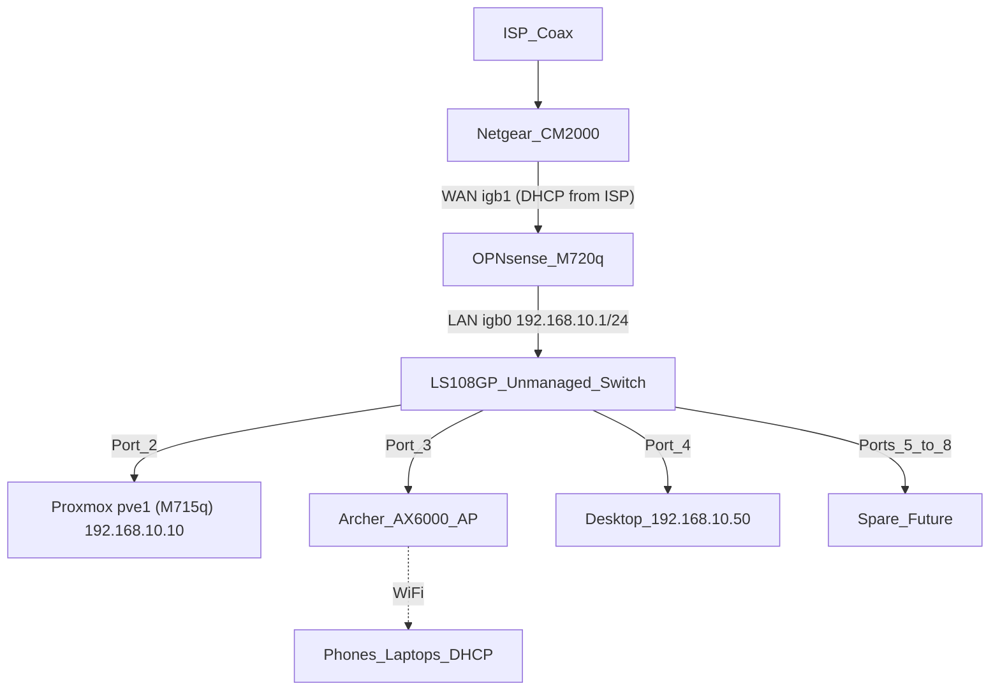
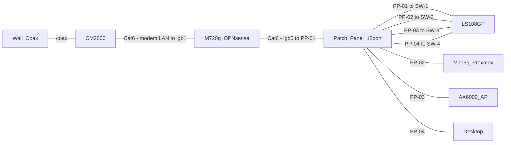

# 01 — Physical Topology

How every device connects, physically and logically. This is the map you check before unplugging anything.

## Logical topology (current, flat LAN)

Everything behind OPNsense is one broadcast domain (`192.168.10.0/24`). There is no segmentation until the managed-switch upgrade in [doc 10](10-vlans-and-segmentation.md).

## Physical cable runs

Full port-by-port assignments, labeling scheme, and the future wall-drop worksheet live in [doc 03](03-cabling-and-patching.md).

## The two golden rules of this topology

1. **The WAN path never touches the switch.** The only cable from the modem goes to OPNsense `igb1`. If the modem is ever patched into the LS108GP, the ISP's DHCP server ends up on your LAN — devices will grab public-ish IPs, bypass the firewall entirely, and OPNsense stops protecting anything. Label both ends of the modem cable `WAN — MODEM ↔ igb1 ONLY`.
2. **Exactly one DHCP server.** OPNsense on `igb0` is it. The AX6000's DHCP must stay disabled (doc 05), and the modem is a pure bridge. Two DHCP servers on one flat LAN cause intermittent, maddening connectivity failures.

## Traffic paths (what goes where)

| Flow | Path |
|------|------|
| Desktop → internet | Port 4 → switch → port 1 → OPNsense → NAT → modem |
| Wi-Fi client → internet | AP → port 3 → switch → port 1 → OPNsense → modem |
| Desktop → Proxmox UI | Port 4 → switch → port 2 (never leaves the switch) |
| VM → VM (same host) | Proxmox bridge `vmbr0`, never leaves the M715q |
| Anything → `192.168.100.1` | OPNsense routes to the modem's management interface |

Note: device-to-device LAN traffic (e.g. Desktop → Proxmox) is switched, not routed — OPNsense never sees it and cannot firewall it. That is a limitation of the flat network; VLANs (doc 10) fix it.

## Failure triage by layer

Work bottom-up when something breaks:

| Symptom | Check first |
|---------|-------------|
| No internet anywhere, LAN works | Modem lights → power-cycle modem → OPNsense Interfaces → WAN |
| No internet + no LAN | OPNsense down? Ping `192.168.10.1` from desktop |
| One wired device offline | Link LED on its switch port; reseat both ends; try a spare port |
| Wi-Fi devices offline, wired fine | AX6000 power / cable on port 3 |
| Wi-Fi connects but no IP | AX6000 DHCP got re-enabled (see doc 05) or OPNsense DHCP pool exhausted |
| Everything slow / flaky IPs | Rogue DHCP server — see golden rule 2 |

## Physical placement notes

- Mini PCs need airflow on at least two sides; do not stack the M720q and M715q directly on top of each other.
- The LS108GP is fanless and passively cooled — keep it out of enclosed drawers.
- All rack gear on the same power strip today; add a UPS when budget allows (see README growth table). When the UPS arrives, put modem + OPNsense + switch on battery first — that keeps Wi-Fi-less basic internet alive through short outages.
