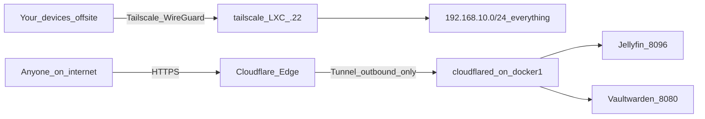

# 08 — Remote Access

Private access first (Tailscale — everything, admin included), public access second (Cloudflare Tunnel — only chosen apps). Zero inbound port-forwards in either case.

## 8.1 — Tailscale (private access to everything)

### Why Tailscale and not opening ports / OPNsense WireGuard

- No inbound ports, no dynamic-DNS dance, NAT traversal just works.
- WireGuard underneath; free tier covers a personal tailnet comfortably.
- One subnet router advertises the whole LAN — no client installs on servers required.

### Install as a subnet router

Best placement: a tiny dedicated LXC (VMID 120, `tailscale`, Debian 12, 512 MB, static `192.168.10.22`) so it can be snapshotted/rebuilt independently:

```bash
apt update && apt install -y curl
curl -fsSL https://tailscale.com/install.sh | sh

# enable IP forwarding
echo 'net.ipv4.ip_forward = 1' >> /etc/sysctl.d/99-tailscale.conf
sysctl -p /etc/sysctl.d/99-tailscale.conf

tailscale up --advertise-routes=192.168.10.0/24 --accept-dns=false
```

(For an unprivileged LXC, add the TUN device in `/etc/pve/lxc/120.conf`: `lxc.cgroup2.devices.allow: c 10:200 rwm` and `lxc.mount.entry: /dev/net/tun dev/net/tun none bind,create=file`.)

Then in the [Tailscale admin console](https://login.tailscale.com/admin):

1. Machines → the new node → **Approve subnet routes** (`192.168.10.0/24`).
2. Disable key expiry for this node (it's infrastructure).
3. DNS → add `192.168.10.2` as a **split DNS** resolver for `home.arpa` — remote devices then resolve `pve1.home.arpa` etc. exactly like at home.

### Clients

Install Tailscale on phone + any laptops; log into the same tailnet. Test from cellular (Wi-Fi off):

- `https://192.168.10.10:8006` (Proxmox) loads
- `http://jellyfin.home.arpa` (or `192.168.10.20:8096`) plays
- Minecraft connects to `192.168.10.21`

### Tailscale hygiene

- 2FA on the Tailscale account (it is now a key to your whole LAN).
- Review Machines list monthly ([doc 13](13-hardening-and-ops.md)); remove stale devices.
- Never share the tailnet with accounts you don't control.

## 8.2 — Cloudflare Tunnel (public access, later, optional)

Do this only when you actually want services reachable by people without Tailscale (e.g. sharing Jellyfin, Vaultwarden sync for family).

### One-time domain setup

1. Buy a domain (Cloudflare Registrar or Porkbun, ~$10–15/yr).
2. Add it to a free Cloudflare account; point registrar nameservers at Cloudflare.
3. Enable 2FA on the Cloudflare account.

### Tunnel deployment

Cloudflare Zero Trust dashboard → Networks → Tunnels → Create tunnel → copy the token, then on `docker1`:

```yaml
# /opt/docker/cloudflared/docker-compose.yml
services:
  cloudflared:
    image: cloudflare/cloudflared:latest
    restart: unless-stopped
    command: tunnel --no-autoupdate run --token ${TUNNEL_TOKEN}
```

Put the token in `/opt/docker/cloudflared/.env` (`TUNNEL_TOKEN=...`), never in the compose file or git.

### Public hostname routes (in the tunnel config)

| Public hostname | Service URL | Exposed? |
|-----------------|------------|----------|
| `jellyfin.yourdomain.com` | `http://192.168.10.20:8096` | Yes, by choice |
| `vault.yourdomain.com` | `http://192.168.10.20:8080` | Yes, by choice — enables proper HTTPS for Bitwarden apps |
| Proxmox / OPNsense / Pi-hole / TrueNAS / Kuma / NPM admin | — | **Never.** Tailscale only |

Optional hardening: Cloudflare Access policies (email OTP allowlist) in front of anything semi-private; CrowdSec on `docker1` watching NPM logs once anything is public.

### The exposure decision checklist (before adding any route)

- [ ] Does someone without Tailscale genuinely need it?
- [ ] Is the app itself authenticated and current?
- [ ] Is its data backed up (doc 09)?
- [ ] CHANGELOG entry written?

## 8.3 — Access model summary



Both paths are **outbound-initiated** from the LAN. OPNsense keeps zero inbound rules; anyone scanning your WAN IP finds nothing.

## Done when

- [ ] Subnet route approved; phone on cellular reaches Proxmox UI and Jellyfin
- [ ] Split DNS makes `home.arpa` names work remotely
- [ ] Tailscale account has 2FA; node key expiry disabled
- [ ] (When public) tunnel up, chosen hostnames resolve with valid TLS, admin UIs still unreachable publicly
- [ ] Confirmed: OPNsense has no port-forwards and no WAN-in allow rules
