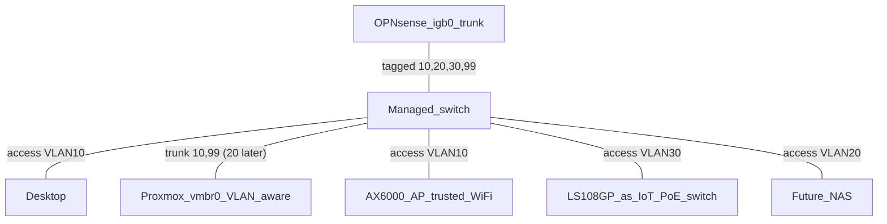

# 10 — VLANs and Network Segmentation

Turn the flat LAN into a segmented network: trusted devices, IoT, and the security lab each in their own VLAN with firewall policy between them.

**Hard prerequisite: a managed switch.** The LS108GP is unmanaged and silently drops/floods 802.1Q semantics — it cannot participate. Everything below waits on that purchase.

## 10.1 — Hardware step: managed switch

| Option | Price | Verdict |
|--------|-------|---------|
| TP-Link TL-SG108E (8-port, "Easy Smart") | ~$30–40 | Cheapest working 802.1Q; clunky UI, no CLI. Fine for learning |
| TP-Link SG2008 / Omada managed | ~$70–90 | Proper L2 management, Omada controller optional. **Recommended** |
| Used enterprise (Cisco SG300, Aruba S2500…) | ~$40–80 | Great CLI learning; louder, more power |

The LS108GP stays in service afterward as a **PoE access switch** hanging off an untagged access port (e.g. all-IoT or all-camera duty) — unmanaged switches are fine downstream of a port that carries exactly one untagged VLAN.

Also note: the AX6000 in AP mode cannot map SSIDs to VLANs. Wi-Fi stays on the Trusted VLAN until the AP is replaced with a VLAN-capable one (TP-Link EAP245, Ubiquiti U6) — budget it with the switch if IoT Wi-Fi isolation matters to you.

## 10.2 — Target design

| VLAN | Name | Subnet | Gateway (OPNsense) | Members |
|------|------|--------|--------------------|---------|
| 10 | TRUSTED | `192.168.10.0/24` | `.1` | Desktop, phones, Proxmox mgmt, all current guests |
| 20 | STORAGE | `192.168.20.0/24` | `.1` | NAS data interfaces (doc 11) |
| 30 | IOT | `192.168.30.0/24` | `.1` | Smart-home gadgets, TVs, cameras |
| 99 | LAB | `192.168.99.0/24` | `.1` | Kali, DVWA, vulnerable VMs (doc 12) |

Keeping Trusted on the existing `192.168.10.0/24` means **no readdressing** of anything built in docs 04–09 — the flat LAN simply becomes VLAN 10.

## 10.3 — OPNsense configuration

1. Interfaces → Devices → VLAN: create `igb0` tag 20 → `STORAGE`, tag 30 → `IOT`, tag 99 → `LAB`. (VLAN 10 rides untagged as the existing LAN — simplest migration; make it tagged later if you want a pure trunk.)
2. Interfaces → Assignments: assign + enable each, static IPs `192.168.20.1/24`, `192.168.30.1/24`, `192.168.99.1/24`.
3. Services → DHCPv4: enable per interface, pools `.100–.199`, DNS `192.168.10.2` (Pi-hole serves all VLANs).
4. Backup config XML before and after (doc 04 §4.0).

## 10.4 — Switch port plan (8-port managed example)

| Port | Mode | VLANs | Connects to |
|------|------|-------|-------------|
| 1 | Trunk | 10 untagged (PVID 10), 20/30/99 tagged | OPNsense `igb0` |
| 2 | Trunk | 10 untagged (PVID 10), 99 tagged (20 later) | Proxmox `pve1` |
| 3 | Access | 10 | AX6000 AP |
| 4 | Access | 10 | Desktop |
| 5 | Access | 20 | NAS (future) |
| 6 | Access | 30 | LS108GP (becomes IoT/PoE segment) |
| 7 | Access | 99 | Spare physical lab port |
| 8 | Access | 10 | Spare trusted |

Update [doc 03](03-cabling-and-patching.md) tables and relabel patch cables when this happens.

## 10.5 — Proxmox changes

Make `vmbr0` VLAN-aware (Node → Network → `vmbr0` → **VLAN aware** ✓, apply). Then per guest NIC, set the VLAN tag: lab VMs get `tag=99`; everything else stays untagged (VLAN 10). No IP changes for existing guests.

## 10.6 — Firewall policy matrix

Default stance: **block inter-VLAN, allow to internet, pinhole what's needed.** Implement top-down per interface in Firewall → Rules; create an alias `RFC1918` (`10.0.0.0/8, 172.16.0.0/12, 192.168.0.0/16`) first.

| From \ To | TRUSTED 10 | STORAGE 20 | IOT 30 | LAB 99 | Internet | Pi-hole `.10.2:53` |
|-----------|-----------|------------|--------|--------|----------|--------------------|
| TRUSTED | — | allow (SMB/NFS/mgmt) | allow (to control gadgets) | admin-desktop only | allow | allow |
| STORAGE | block | — | block | block | allow (updates) | allow |
| IOT | **block** | block | — | block | allow | allow |
| LAB | **block** | block | block | — | allow | allow |

Per-interface recipe (IOT shown; STORAGE/LAB identical pattern):

1. Allow: IOT net → `192.168.10.2` port 53 (TCP/UDP)
2. Block: IOT net → `RFC1918` alias
3. Allow: IOT net → any (internet)

On TRUSTED, add above the allow-any: allow TCP from `192.168.10.50` (admin desktop) → LAB net (for reaching lab consoles/DVWA).

## 10.7 — Verification (do all of these)

- [ ] From a LAB VM: `ping 192.168.10.10` **fails**; `ping 1.1.1.1` succeeds; `nslookup google.com` succeeds via `.10.2`
- [ ] From an IOT device: cannot reach `192.168.10.x` at all
- [ ] From desktop: can open a LAB VM's web page (pinhole works)
- [ ] Existing services (docs 07–08) still work unchanged for trusted clients
- [ ] Tailscale remote access still reaches VLAN 10; add `--advertise-routes=192.168.20.0/24` etc. only if remote access to other VLANs is wanted
- [ ] OPNsense config XML re-exported; CHANGELOG entry written; docs 01/02/03 tables updated

## Done when

All verification boxes pass and the updated port maps/labels match physical reality. Then [doc 12](12-security-lab.md) is unblocked.
