# Project 01 – Lab Foundation and Networking

## Overview

This project documents the initial buildout of my cybersecurity homelab foundation. The goal of this phase was to prepare the local workspace, organize installation media, configure VirtualBox networking, deploy the first virtual machines, and assign static IP addresses for the internal lab network.

This phase establishes the base environment that later phases will build on for Active Directory, attack simulation, log collection, and defensive monitoring.

---

## Objectives

- Build the initial VirtualBox-based lab environment
- Organize required ISO files and project documentation
- Configure a host-only network for internal lab communication
- Create the initial lab virtual machines
- Assign static IP addresses based on a planned addressing scheme
- Verify basic internal connectivity between systems
- Document the environment in a clean and repeatable way

---

## Environment Summary

### Host system
- Windows 11 desktop
- Oracle VirtualBox
- Project workspace stored on local disk

### Virtual machines created
- `DC-01` – Windows Server 2022
- `WINCLIENT-01` – Windows 11
- `KALI-01` – Kali Linux
- `UBUNTU-01` – Ubuntu Server

---

## Project Workspace

The first step was creating a clean folder structure for ISOs, notes, screenshots, and exports.

---

## Installation Media

All required ISO files were collected before deployment.

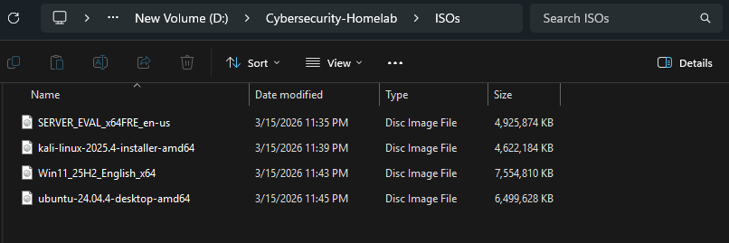

---

## VirtualBox Network Configuration

A host-only adapter was configured to provide internal lab communication on the `192.168.56.0/24` network.

---

## IP Addressing Plan

The lab followed a simple static addressing plan to keep systems predictable and easy to document.

See [docs/asset-inventory.md](../../docs/asset-inventory.md) for the full asset table and IP addressing plan.

---

## DC-01 Build

The first server deployed in the lab was `DC-01`, which will later support identity and directory services in future phases.

### VM creation
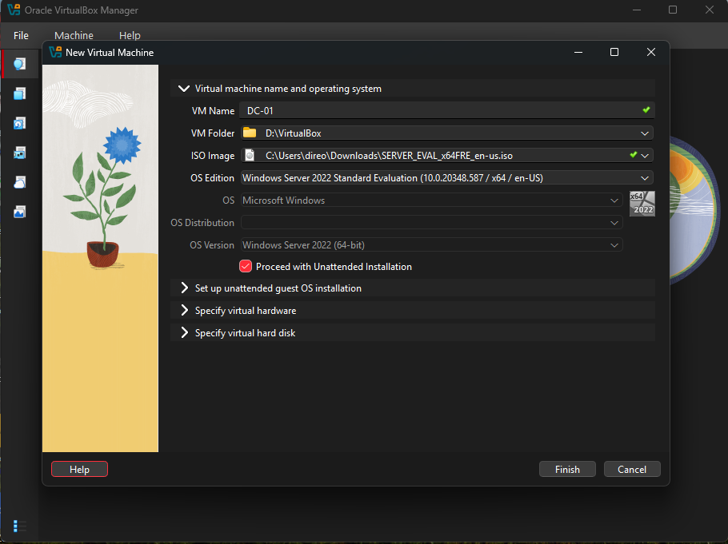

### Static IPv4 configuration
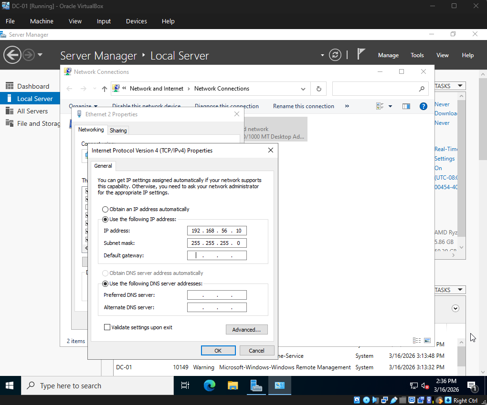

### IP verification
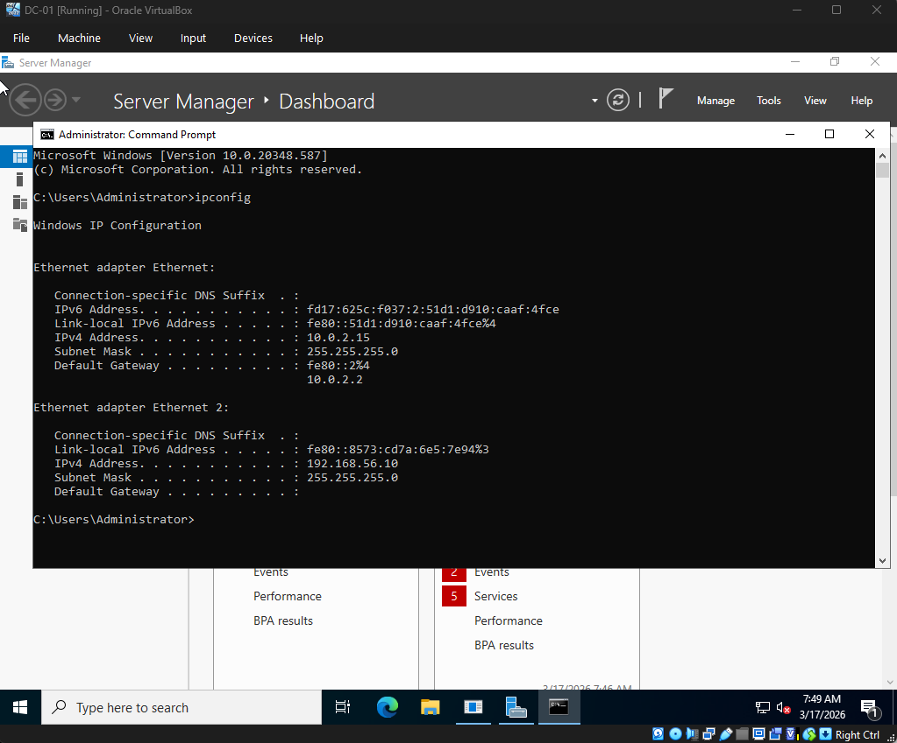

---

## WINCLIENT-01 Build

The Windows client workstation was created to serve as the first user endpoint in the lab.

### VM creation
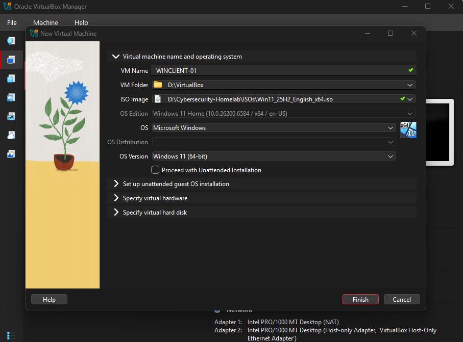

### Static IPv4 configuration
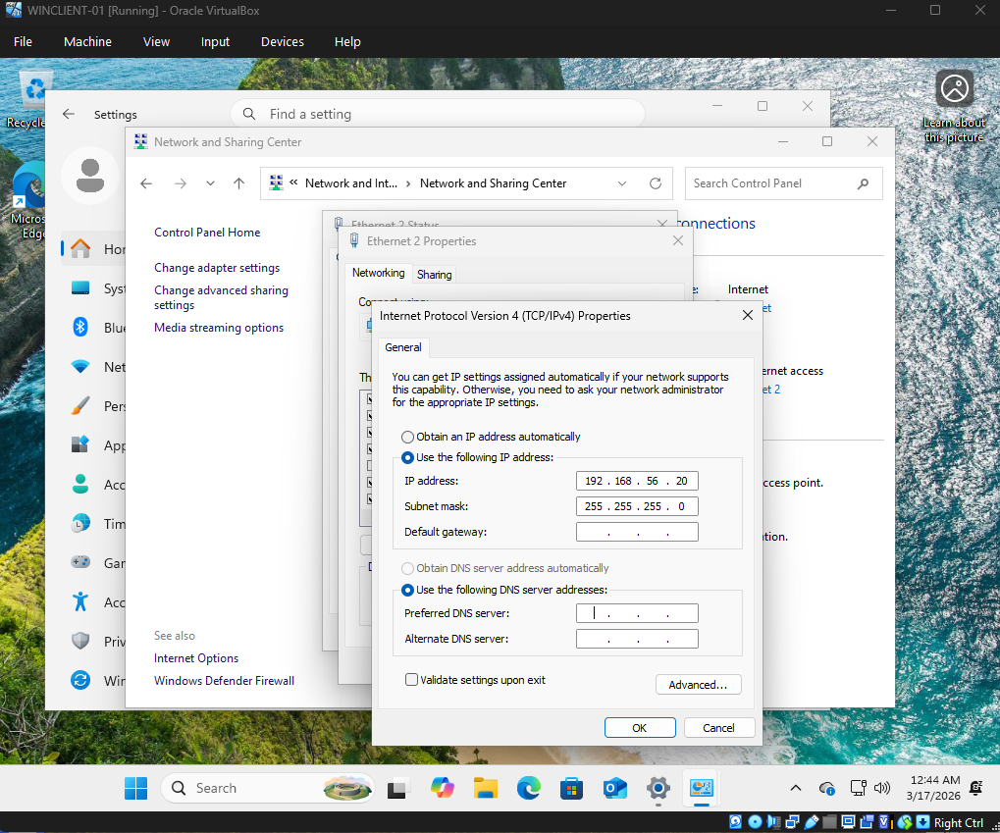

### IP verification
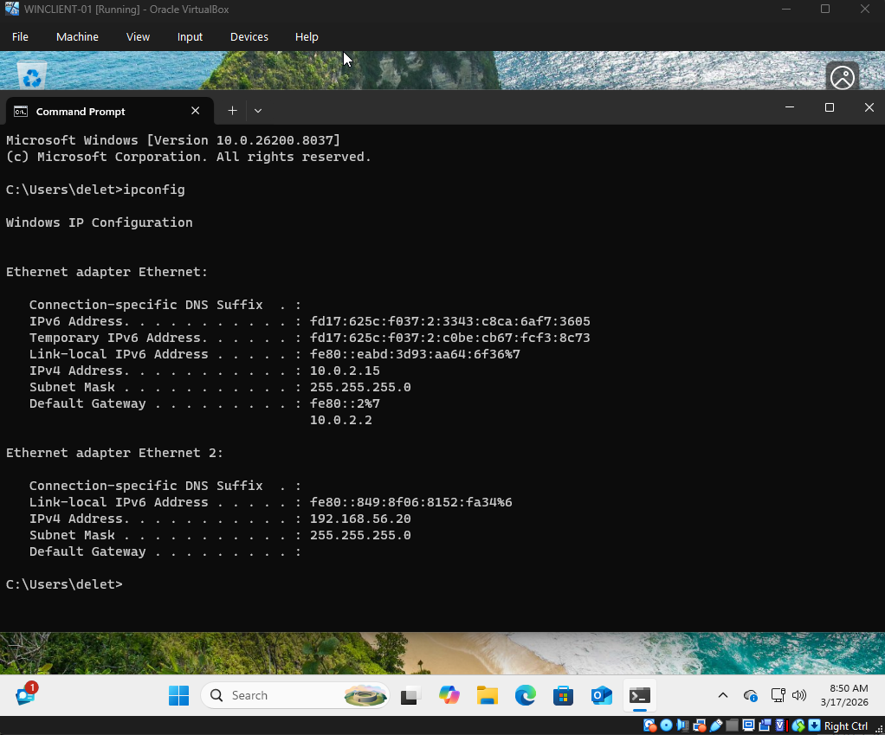

---

## KALI-01 Build

Kali Linux was deployed as the offensive testing and attack simulation system.

### VM creation
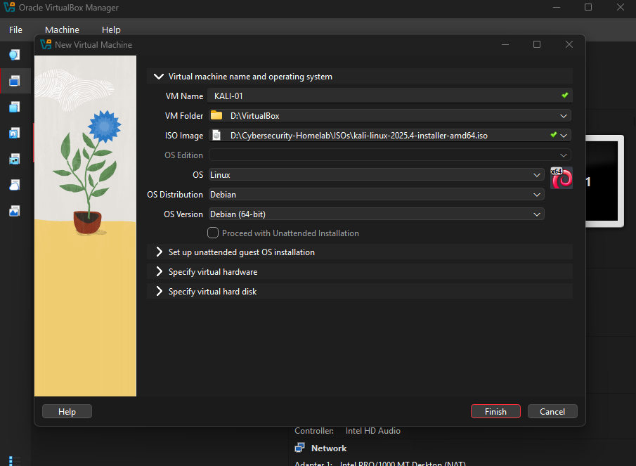

### Interface verification
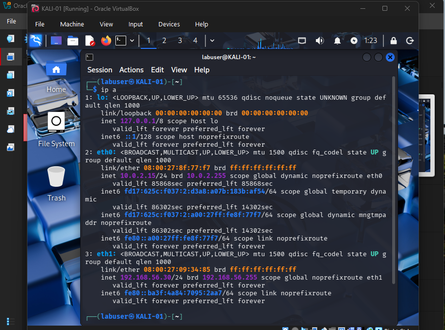

### Hostname verification
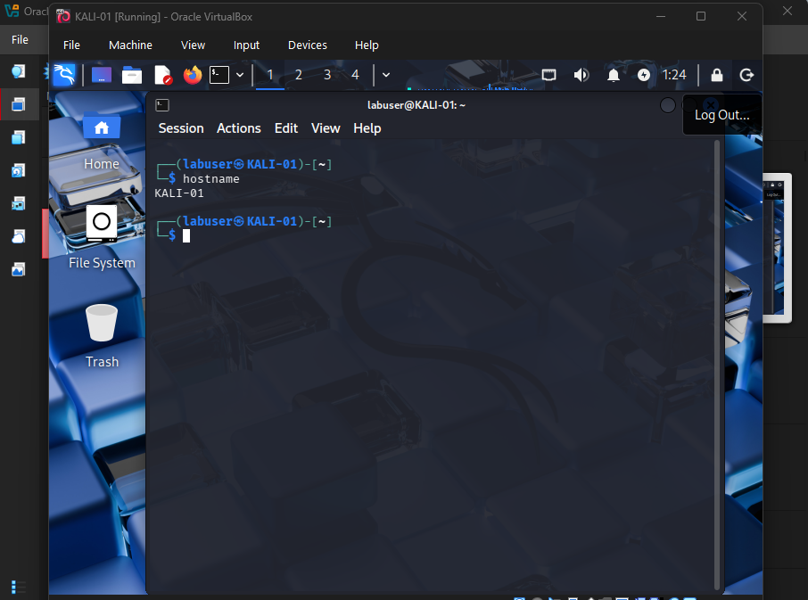

---

## UBUNTU-01 Build

Ubuntu Server was added as a general-purpose Linux server for future services, testing, and infrastructure expansion.

### VM creation
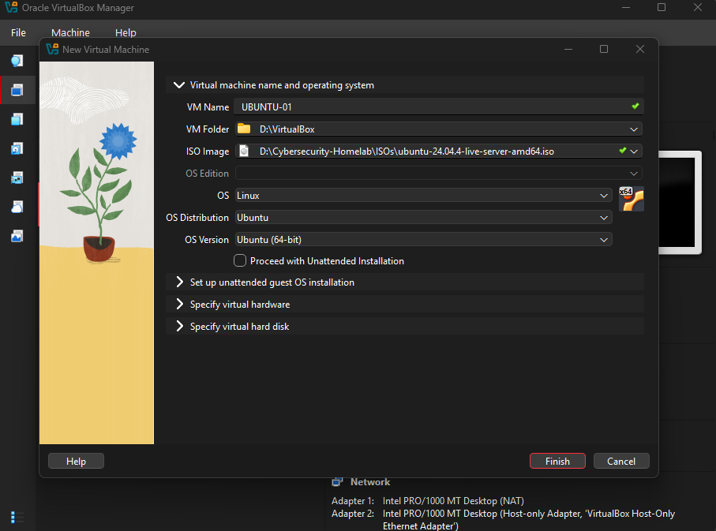

### Static IPv4 configuration
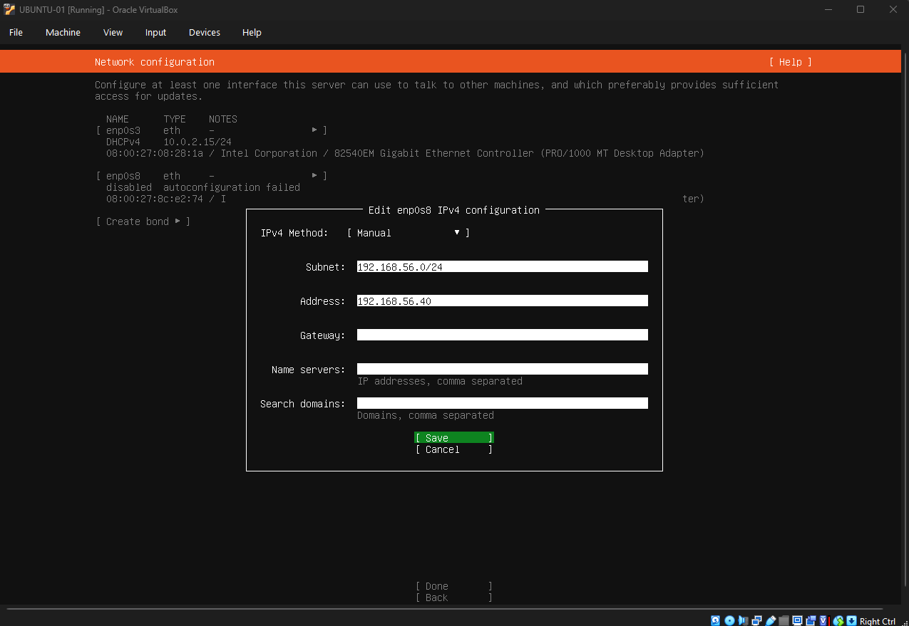

### Hostname and interface verification
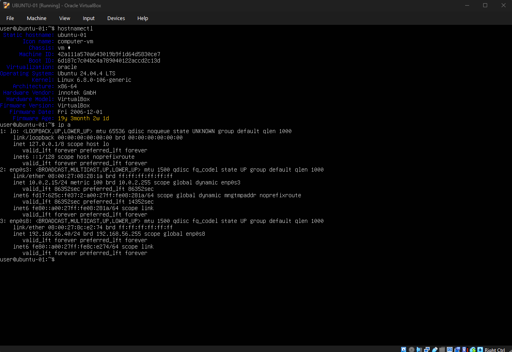

---

## Current Lab State

At the end of this phase, all primary systems were created and running in VirtualBox.

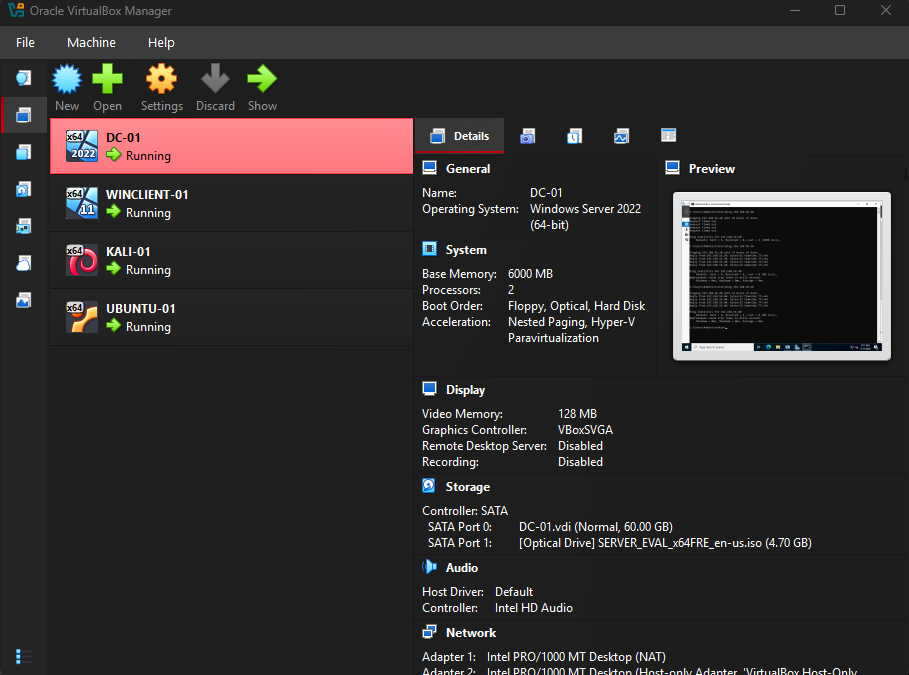

---

## Key Outcomes

- Built the first four core virtual machines
- Established a documented host-only lab subnet
- Assigned static internal IPs to each system
- Verified core interface configuration across Windows and Linux systems
- Created a repeatable foundation for later phases

---

## Notes

This phase intentionally focused on infrastructure preparation and internal networking only. Identity services, domain join operations, SIEM deployment, logging, and attack simulation will be added in later projects.

Some connectivity tests showed expected limitations between certain systems at this stage, especially where host firewalls or default OS settings prevented ICMP replies. Those screenshots are better documented in troubleshooting notes rather than the main build walkthrough.

---

## Next Phase

Next, the lab will expand into identity and access configuration, likely beginning with Active Directory setup and Windows client domain integration.
